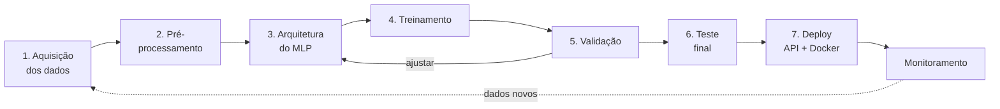
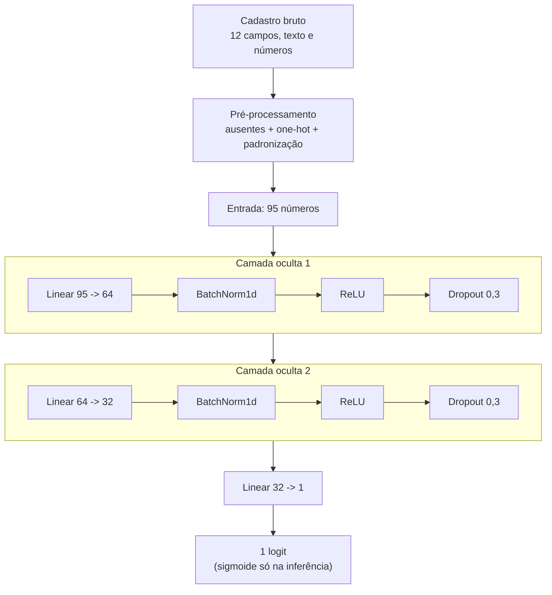

# Aula — Perceptron Multicamadas na prática: do dado ao deploy

**Disciplina:** ARTIFICIAL INTELLIGENCE e DEEP LEARNING APPLICADA
**Professor:** Dr. Alexandre Miguel de Carvalho
**Ferramentas:** Python 3.12 · PyTorch 2.5 (CPU) · pandas · FastAPI

---

## 1. Por que esta aula existe

A maioria dos tutoriais de rede neural termina quando a acurácia aparece na tela. Só que um modelo que existe apenas dentro de um notebook não resolve problema nenhum.
O que separa um exercício de um sistema é o **pipeline completo**:



Nesta aula você percorre as **sete etapas** com um problema pequeno o bastante
para rodar em CPU em menos de um minuto, mas completo o bastante para ser
honesto: separação correta de dados, pré-processamento sem vazamento, tratamento
de classe desbalanceada, escolha de limiar de decisão, métricas que não mentem,
exportação para produção e um serviço HTTP funcionando.

### Aplicação escolhida

**Prever se a renda anual de uma pessoa passa de US$ 50 mil** a partir de 12
informações de um cadastro: idade, escolaridade, ocupação, carga horária,
estado civil, país de origem e mais algumas. Dataset **Adult / Census Income**
(censo dos EUA de 1994, repositório UCI) — 48.842 pessoas, partição oficial de
treino e teste já definida.

Por que esse dataset numa aula de MLP:

| Critério | Justificativa |
|---|---|
| Formato | **Tabular** — é onde o MLP é a arquitetura correta, não uma CNN ou um Transformer |
| Tamanho | 48 mil linhas, ~600 KB — baixa em segundos |
| Custo | Treina em **~0,5 s por época na CPU**, sem GPU |
| Sujeira realista | Tem valores ausentes (`?`), colunas categóricas de alta cardinalidade e uma variável com cauda longa até 99.999 |
| Desbalanceamento | Só **24% da classe positiva** — o que obriga a discutir por que acurácia é uma métrica ruim |
| Consequência | É um problema de decisão sobre pessoas: rende a discussão de viés que um classificador de dígitos não rende |

> **Sobre este dataset:** ele reflete o censo dos EUA de 1994, com todas as
> desigualdades salariais daquela sociedade. O modelo aprende essas
> desigualdades — inclusive as ligadas a sexo, raça e origem. Isso não é um
> defeito do exercício, é o objeto da §7-D: o que fazer quando o padrão
> estatístico correto é socialmente indesejável.

---

## 2. Objetivos de aprendizagem

Ao final da aula, o estudante deve ser capaz de:

1. **Explicar** por que uma camada oculta com não-linearidade resolve problemas que o perceptron de uma camada não resolve, usando o XOR como demonstração.
2. **Construir** um pipeline de pré-processamento tabular (ausentes, categóricas, escala) que aprende os parâmetros **apenas no treino** e os aplica aos demais conjuntos.
3. **Implementar** o laço de treinamento (forward → perda → `zero_grad` → `backward` → `step`) e explicar o papel de cada passo.
4. **Tratar** classe desbalanceada com `pos_weight` e justificar por que acurácia é uma métrica enganosa nesse cenário.
5. **Diagnosticar** underfitting e overfitting a partir das curvas de perda e AUC.
6. **Escolher** o limiar de decisão na validação e explicar o compromisso entre precisão e revocação que ele controla.
7. **Publicar** o modelo como serviço: TorchScript + pré-processador serializado, API REST e contêiner Docker.

---

## 3. Preparação do ambiente

```bash
conda activate p_312          # ambiente já existente nesta máquina
cd caminho/para/mlp
pip install -r requirements.txt
```

Verificação rápida:

```bash
python -c "import torch, pandas; print(torch.__version__, pandas.__version__)"
# 2.5.1+cpu 2.2.3
```

> **Windows:** se os acentos aparecerem quebrados no terminal, rode `chcp 65001`
> ou defina `set PYTHONIOENCODING=utf-8` antes dos scripts.

### Estrutura do projeto

```
mlp/
├── README.md              <- esta aula
├── exercicios.md          <- atividades e rubrica de avaliação
├── requirements.txt
├── src/
│   ├── config.py          <- ETAPA 0: colunas, hiperparâmetros e caminhos
│   ├── utils.py           <- semente, métricas (AUC, F1) e gráficos
│   ├── data.py            <- ETAPAS 1 e 2: download + pré-processamento
│   ├── xor.py             <- demonstração histórica: por que "multicamadas"
│   ├── model.py           <- ETAPA 3: arquitetura do MLP
│   ├── train.py           <- ETAPAS 4 e 5: treinamento + validação + limiar
│   ├── evaluate.py        <- ETAPA 6: teste, métricas, importância das features
│   ├── predict.py         <- inferência em cadastros novos
│   └── export_model.py    <- ETAPA 7-A: TorchScript + preprocessador.json
├── deploy/
│   ├── api.py             <- ETAPA 7-B: serviço FastAPI
│   ├── testar_api.py      <- teste de integração do serviço
│   └── Dockerfile         <- ETAPA 7-C: contêiner
├── data/                  <- dataset (baixado automaticamente)
└── outputs/               <- pesos, gráficos e métricas gerados
```

---

## 4. Fundamentos: o mínimo de teoria necessário

### 4.1 O neurônio artificial

Um neurônio faz duas coisas: uma soma ponderada e uma função de ativação.

$$z = \sum_{i=1}^{n} w_i x_i + b \qquad\qquad a = f(z)$$

Os pesos $w$ dizem quanto cada entrada importa; o viés $b$ desloca o limiar de
ativação; a função $f$ introduz a não-linearidade. **Só isso.** Uma rede com
95 entradas, duas camadas ocultas e 8.353 parâmetros é essa conta repetida
8.353 vezes.

### 4.2 Por que "multicamadas": o problema do XOR

```bash
python src/xor.py
```

```
  x1  x2  alvo   sem oculta   com oculta
   0   0     0        0.500        0.000
   0   1     1        0.500        1.000
   1   0     1        0.500        1.000
   1   1     0        0.500        0.000

sem camada oculta: perda final 0.6931 | acertos 2/4
com camada oculta: perda final 0.0000 | acertos 4/4
```

Esta é a demonstração de Minsky e Papert (1969) que congelou a área por quase
duas décadas: **não existe uma reta que separe `{(0,0),(1,1)}` de
`{(0,1),(1,0)}`**. O perceptron de uma camada trava em 2/4 — e note que ele
converge para 0,5 em todos os pontos, ou seja, desiste e chuta. Treinar mais
não adianta: o problema não é o otimizador, é a **capacidade do modelo**.

Uma camada oculta com **dois neurônios** resolve, porque ela reescreve o dado
num espaço onde o problema *fica* linearmente separável. Veja
`outputs/xor_fronteira.png`: à esquerda uma reta, à direita duas regiões.

Essa é a ideia que sustenta o resto da aula: a camada oculta não é "mais do
mesmo", ela **muda a representação do dado**.

### 4.3 Por que a não-linearidade é obrigatória

Sem função de ativação, empilhar camadas seria inútil:

$$W_3(W_2(W_1 x)) = (W_3 W_2 W_1)\,x = W x$$

Mil camadas lineares colapsam em **uma** transformação linear — um modelo com a
mesma capacidade de uma regressão logística, gastando mil vezes mais memória.
Troque `nn.Tanh()` por `nn.Identity()` em `xor.py` e veja a rede voltar a falhar.

| Ativação | Fórmula | Observação |
|---|---|---|
| Sigmoide | $1/(1+e^{-z})$ | Satura nas pontas; derivada máxima 0,25 → gradiente some em redes profundas |
| Tanh | $\tanh(z)$ | Centrada em zero, mas ainda satura |
| **ReLU** | $\max(0, z)$ | Padrão moderno: barata e não satura para $z>0$ |

### 4.4 Teorema da aproximação universal

Uma rede com **uma** camada oculta suficientemente larga aproxima qualquer
função contínua com a precisão que você quiser. Cuidado com a leitura: o
teorema garante que tal rede **existe** — não que o gradiente descendente vá
encontrá-la, nem com quantos dados. Na prática, várias camadas estreitas
costumam aprender melhor que uma única muito larga.

### 4.5 Por que MLP e não CNN aqui

Numa imagem, pixels vizinhos têm relação espacial — daí faz sentido um filtro
que desliza. Numa tabela, `occupation` e `relationship` não são "vizinhas" em
nenhum sentido: **trocar a ordem das colunas não muda o problema**. Sem
estrutura local para explorar, a camada totalmente conectada é a escolha
correta.

| | CNN (imagens) | MLP (tabelas) |
|---|---|---|
| Estrutura explorada | Vizinhança espacial | Nenhuma — toda entrada liga a todo neurônio |
| Pesos | Compartilhados pelo filtro | Um peso por par (entrada, neurônio) |
| Pré-processamento | Redimensionar e normalizar | Ausentes, categóricas, escala — o trabalho pesado |
| Erro típico | Normalização diferente na inferência | Pré-processador que não viajou com o modelo |

### 4.6 A arquitetura desta aula



De onde vêm os **8.353 parâmetros** (`python src/model.py` imprime esta conta):

| Camada | Pesos | Extras | Subtotal |
|---|---|---|---|
| oculta 1 | 95 × 64 = 6.080 | 128 (BatchNorm) | 6.208 |
| oculta 2 | 64 × 32 = 2.048 | 64 (BatchNorm) | 2.112 |
| saída | 32 × 1 = 32 | 1 (viés) | 33 |
| **total** | | | **8.353** |

Repare que a saída tem **um** neurônio, não dois. Em classificação binária
basta um escore: $P(\text{classe }1) = \sigma(z)$ e
$P(\text{classe }0) = 1 - \sigma(z)$. Duas saídas com softmax dariam o mesmo
resultado com o dobro de parâmetros na última camada.

### 4.7 Como a rede aprende

1. **Perda** — `BCEWithLogitsLoss` mede a distância entre a probabilidade prevista e o rótulo. Se a rede dá 90% para quem realmente ganha >50k, a perda é baixa; se dá 5%, é alta.
2. **Retropropagação** — `loss.backward()` aplica a regra da cadeia camada a camada e calcula, para cada peso, quanto ele contribuiu para o erro.
3. **Otimizador** — `optimizer.step()` move cada peso na direção contrária ao seu gradiente, com passo proporcional à taxa de aprendizado.

Repetir isso por alguns milhares de lotes é, literalmente, todo o "aprendizado".

---

## 5. O pipeline, etapa por etapa

### ETAPA 1 — Aquisição dos dados

**Arquivo:** [src/data.py](src/data.py) · **Comando:** `python src/data.py`

O script baixa `adult.zip` do repositório da UCI para `data/` na primeira
execução. Em projeto real esta etapa seria uma consulta ao banco ou um dump do
data warehouse — e é normalmente onde vai a maior parte do esforço.

Duas armadilhas do arquivo, ambas clássicas em dados públicos e ambas tratadas
em `carregar_dataframes()`:

- `adult.test` tem uma **linha de comentário no topo** (`|1x3 Cross validator`);
- nele o rótulo vem com **ponto final**: `>50K.` em vez de `>50K`. Quem não trata isso acaba com 100% de `<=50K` no teste e não entende por que a acurácia deu exatamente a prevalência.

O ponto pedagógico é o **particionamento**:

| Conjunto | Tamanho | % de >50K | Para que serve | Quem pode "ver" |
|---|---|---|---|---|
| Treino | 26.049 | 24,1% | Ajustar os pesos | O otimizador |
| Validação | 6.512 | 24,1% | Hiperparâmetros, early stopping, **limiar** | Você, muitas vezes |
| Teste | 16.281 | 23,6% | Estimar o desempenho real | Ninguém, até o fim |

A UCI já entrega treino e teste separados — usamos a partição oficial, que é o
que permite comparar seu resultado com o de qualquer outro trabalho. A
validação é retirada de dentro do treino, de forma **estratificada** (mantendo
a mesma proporção de classes; sem isso, uma validação sai com 21% de positivos
e outra com 27%, e você compara experimentos medindo coisas diferentes).

**O conjunto de teste é usado uma única vez, no final.** Se você ajustar
qualquer coisa olhando o teste, ele deixou de ser teste e virou validação — e
seu número final passa a ser otimista, isto é, mentiroso.

### ETAPA 2 — Pré-processamento

**Arquivo:** [src/data.py](src/data.py) → classe `Preprocessador`

Aqui está a diferença real entre dados tabulares e imagens. Em visão,
pré-processar é redimensionar e normalizar. Aqui são quatro decisões, cada uma
com uma armadilha:

**a) Colunas descartadas.** `fnlwgt` é o *peso amostral do censo* — informação
sobre o processo de amostragem, não sobre a pessoa. `education` é redundante
com `education-num`, que já é a mesma informação em escala ordinal (1 =
pré-escola … 16 = doutorado).

**b) Valores ausentes.** O arquivo marca ausente como `?`, em três colunas:

```
workclass           1462  (5,6%)
occupation          1465  (5,6%)
native-country       464  (1,8%)
```

Numéricos recebem a **mediana do treino** (robusta a extremos, ao contrário da
média). Categóricos viram uma categoria explícita, `"Desconhecido"` — porque
"não informado" muitas vezes *é* informação.

**c) Categóricas → números.** Rede neural não come texto. Usamos **one-hot**:
cada categoria vira uma coluna 0/1. As 7 colunas categóricas viram 90 colunas.

> **Por que não numerar as categorias (`Private=1, State-gov=2, ...`)?** Porque
> isso inventa uma ordem que não existe e diz à rede que `State-gov` está entre
> `Private` e `Self-emp`. Codificação ordinal só vale quando a ordem é real —
> como em `education-num`, que por isso mesmo entra direto, sem one-hot.

**d) Escala.** `capital-gain` vai até 99.999 e `hours-per-week` até 99. Sem
padronizar, a primeira domina a segunda só por ser numericamente maior, e o
gradiente fica desbalanceado entre as direções. Duas operações, nesta ordem:

```python
valores = np.log1p(valores)                    # só em capital-gain/loss
z = (valores - media_treino) / desvio_treino   # padronização
```

O `log1p` existe porque **92% das pessoas têm `capital-gain = 0`** e o máximo é
99.999: sem comprimir a cauda, a padronização é decidida por meia dúzia de
valores extremos.

> **REGRA DE OURO — e o vazamento mais comum em dados tabulares.**
> Tudo o que é *aprendido* dos dados (mediana, lista de categorias, média e
> desvio) tem que ser aprendido **somente no treino** e apenas *aplicado* à
> validação e ao teste. Calcular a média do dataset inteiro antes de separar
> não gera erro nenhum: a validação só fica otimista e o modelo decepciona em
> produção. A saída de `python src/data.py` mostra isso explicitamente:
>
> ```
> age              treino: média +0.000 desvio 1.000   |   validação: média -0.008 desvio 0.995
> capital-gain     treino: média -0.000 desvio 1.000   |   validação: média -0.022 desvio 0.962
> ```
>
> Na validação **não** dá exatamente 0 e 1 — e isso está certo. Se desse,
> haveria vazamento.

Resultado: **95 colunas numéricas** (5 padronizadas + 90 one-hot).

**Execute e olhe os gráficos** em `outputs/exploracao_dados.png`. Sempre
inspecione os dados antes de treinar: um modelo alimentado com dados errados
não reclama, ele apenas aprende a coisa errada com toda a confiança do mundo.

### ETAPA 3 — Arquitetura

**Arquivo:** [src/model.py](src/model.py) · **Comando:** `python src/model.py`

```
Entrada: 95 features
Parâmetros treináveis: 8,353

Entrada (4, 95) -> logits (4,)
logits         : [0.126 0.938 0.559 0.781]
probabilidades : [0.531 0.719 0.636 0.686]  (só após a sigmoide)
```

Três detalhes de implementação que valem a discussão:

- **O `forward` devolve *logit*, sem sigmoide.** `nn.BCEWithLogitsLoss` já aplica a sigmoide internamente, de forma numericamente estável. Colocar sigmoide no modelo e usar `BCELoss` funciona em teoria, mas satura e produz `NaN` com logits grandes. A sigmoide entra só na hora de interpretar a saída como probabilidade.
- **Inicialização de He (Kaiming).** Pesos todos iguais a zero seriam fatais: todos os neurônios de uma camada receberiam o mesmo gradiente e aprenderiam a mesma coisa para sempre — o problema da simetria. Pesos grandes demais explodem as ativações; pequenos demais, somem.
- **`bias=False` antes do BatchNorm.** O BatchNorm já tem um termo de deslocamento; o viés da camada linear seria redundante.

### ETAPA 4 — Treinamento

**Arquivo:** [src/train.py](src/train.py)

```bash
python src/train.py --rapido        # ~5 s, para demonstrar em sala
python src/train.py                 # treino completo, ~0,5 s/época
```

O núcleo, que se repete em todo projeto PyTorch:

```python
logits = modelo(x)                       # 1. forward
perda  = criterio(logits, y)             # 2. perda
otimizador.zero_grad(set_to_none=True)   # 3. zerar gradientes anteriores
perda.backward()                         # 4. retropropagação
otimizador.step()                        # 5. atualizar pesos
```

> **Esquecer o `zero_grad()` é o bug nº 1 de quem começa.** O PyTorch *acumula*
> gradientes por padrão (recurso útil para simular lotes grandes). Sem zerar, o
> gradiente do lote 100 carrega a soma dos 99 anteriores e o treino diverge sem
> nenhuma mensagem de erro.

**O que muda por causa do desbalanceamento.** Só 24% da amostra é da classe
positiva. Sem tratamento, o caminho mais fácil para a rede é dizer "não" para
todo mundo e acertar 76%. Duas providências:

- **`pos_weight = n_negativos / n_positivos ≈ 3,15`** na perda: cada positivo pesa 3,15 vezes mais que um negativo.
- **Checkpoint escolhido pelo AUC-ROC de validação**, não pela acurácia. O AUC mede a qualidade do *ordenamento* e não depende do limiar — é a métrica certa para selecionar modelo quando a decisão final ainda vai ser calibrada.

Recursos de treino sério já incluídos:

- **Checkpoint do melhor modelo** — salva quando o AUC de *validação* melhora, não na última época. A última quase nunca é a melhor.
- **Early stopping** (`paciencia=6`) — interrompe quando a validação para de melhorar.
- **`ReduceLROnPlateau`** — reduz a taxa de aprendizado pela metade quando a validação estaciona: passos grandes para explorar, passos pequenos para refinar.
- **Semente fixa** — sem `definir_semente()`, dois treinos idênticos dão números diferentes e a comparação entre experimentos perde o sentido.

Saída real (semente 42, CPU):

```
época   1/40 | perda tr 0.8450 va 0.6285 | AUC va 0.8919 | F1 va 0.6526 | acc va 77.96%  <- melhor
época  10/40 | perda tr 0.5886 va 0.5735 | AUC va 0.9083 | F1 va 0.6844 | acc va 80.53%  <- melhor
época  23/40 | perda tr 0.5759 va 0.5685 | AUC va 0.9098 | F1 va 0.6857 | acc va 80.54%  <- melhor
época  29/40 | perda tr 0.5704 va 0.5708 | AUC va 0.9095 | F1 va 0.6891 | acc va 81.17%

Early stopping na época 29 (paciência = 6).

Melhor AUC de validação: 0.9098 (época 23)
Limiar 0,50 (padrão) -> F1 0.6857 | precisão 0.561 | revocação 0.881
Limiar 0.65 (ótimo na validação) -> F1 0.6941
```

### ETAPA 5 — Validação (o diagnóstico)

Ao final, abra `outputs/curvas_treino.png`. É o gráfico mais importante da
disciplina:

| O que você vê | Diagnóstico | O que fazer |
|---|---|---|
| Ambas as perdas altas e paradas | **Underfitting** — modelo fraco demais | Camadas maiores, treinar mais, aumentar o *lr* |
| Perda de treino cai, a de validação **sobe** | **Overfitting** — está decorando | Mais dropout, *weight decay*, mais dados, early stopping |
| Perda oscilando muito | Taxa de aprendizado alta demais | Reduzir o *lr*, aumentar o *batch* |
| As duas caem juntas e estabilizam | Saudável | Pode tentar aumentar a capacidade do modelo |

O que caracteriza validação (e não treino) no código: `modelo.eval()` para
desligar dropout e congelar as estatísticas do BatchNorm, `torch.no_grad()`
para não construir o grafo de derivadas, e ausência de `backward()`/`step()`.

**A validação também escolhe o limiar de decisão.** O modelo devolve uma
probabilidade contínua; transformá-la em "sim/não" exige um corte. O padrão
0,5 não tem nada de especial — `train.py` varre limiares de 0,05 a 0,95 e fica
com o de maior F1 **na validação** (0,65 nesta execução). Escolher o limiar
olhando o teste é a mesma coisa que ajustar hiperparâmetro no teste.

### ETAPA 6 — Teste final

**Arquivo:** [src/evaluate.py](src/evaluate.py) · **Comando:** `python src/evaluate.py`

Saída real desta implementação (semente 42, CPU):

```
TESTE — 16281 pessoas (usado UMA única vez)
========================================================================
AUC-ROC                0.9053   (0,5 = chute)
Precisão média (AUC-PR)  0.7542   (linha de base = 0.2362)

No limiar 0.65:
  acurácia       83.31%
  precisão       0.620   (dos previstos >50K, quantos eram)
  revocação      0.759   (dos >50K reais, quantos achei)
  F1             0.682
  especificidade 0.856   (dos <=50K reais, quantos acertei)
  matriz        VN=10645  FP=1790  FN=928  VP=2918

Linhas de base:
  chutar sempre '<=50K'  -> acurácia 76.38%, revocação 0,000 (não encontra ninguém)
  chutar ao acaso        -> AUC 0,500
```

**Leia a linha de base antes de comemorar os 83%.** Um modelo que responde
`<=50K` para todo mundo — três linhas de código, zero aprendizado — acerta
**76,38%**. A CNN da outra disciplina compete contra 10% de chute aleatório;
aqui o adversário é bem mais duro. Os 83,31% valem 7 pontos acima do trivial —
mas o que realmente separa os dois modelos é a revocação: **0,759 contra 0,000**.
O modelo trivial não encontra *ninguém*.

**O limiar move precisão e revocação em direções opostas.** O mesmo modelo, com
o corte em 0,50:

| Limiar | Acurácia | Precisão | Revocação | F1 | AUC |
|---|---|---|---|---|---|
| 0,50 | 79,38% | 0,539 | **0,873** | 0,667 | 0,9053 |
| **0,65** (escolhido) | **83,31%** | **0,620** | 0,759 | **0,682** | 0,9053 |

O AUC é **idêntico** nos dois casos: o limiar não muda o modelo, apenas onde
você corta a mesma lista ordenada. Qual dos dois é o certo depende do custo do
erro — e essa é uma decisão de negócio, não de estatística. Numa triagem de
fraude, um falso negativo custa caro e você desce o limiar; numa aprovação
automática de crédito, um falso positivo custa caro e você sobe.

Além das métricas, o script gera:

- **`outputs/matriz_confusao.png`** — VN, FP, FN e VP com contagem e percentual por linha. Os 1.790 falsos positivos são pessoas que o modelo diz que ganham mais de 50k e não ganham.
- **`outputs/curvas_roc_pr.png`** — a ROC e a curva Precisão-Revocação. Repare que a linha de base da P-R é **0,236** (a prevalência), não 0,5 como na ROC: é por isso que a curva P-R é mais honesta quando a classe positiva é rara.
- **`outputs/importancia_permutacao.png`** — quanto o AUC cai ao embaralhar uma coluna de cada vez. É o análogo tabular de visualizar os filtros de uma CNN:

```
education-num                      queda de AUC +0.0379
age                                queda de AUC +0.0301
capital-gain                       queda de AUC +0.0193
hours-per-week                     queda de AUC +0.0157
marital-status=Married-civ-spouse  queda de AUC +0.0146
```

Escolaridade, idade e ganho de capital dominam — o que bate com a intuição. Já
`marital-status=Married-civ-spouse` aparecendo em quinto merece discussão: ser
casado não *causa* renda alta; a variável está capturando estrutura social do
censo de 1994. **Importância não é causalidade.** E colunas correlacionadas
dividem a importância entre si: embaralhar uma delas deixa a informação
disponível na outra, e as duas parecem menos importantes do que são.

**Referências para comparar seu resultado:**

| Abordagem | Acurácia no teste | AUC |
|---|---|---|
| Chutar sempre `<=50K` | 76,4% | 0,500 |
| Regressão logística | ~85% | ~0,90 |
| **Este MLP (~15 s de CPU)** | **83,3%** | **0,905** |
| Gradient boosting (XGBoost/LightGBM) | ~87% | ~0,927 |

> Sim: **em dados tabulares, árvores com boosting frequentemente batem redes
> neurais**, e é honesto dizer isso numa aula de rede neural. O MLP aqui está
> deliberadamente com o limiar otimizado para F1 (o que sacrifica acurácia em
> favor da revocação); em acurácia pura ele chega perto de 85%. A lição vale
> mais que o número: **escolha de arquitetura é uma decisão empírica**, e quem
> começa um projeto tabular por deep learning normalmente está começando pelo
> lugar errado.

### ETAPA 7 — Deploy

#### 7-A. Exportar o modelo

```bash
python src/export_model.py          # gera os 3 artefatos
python src/export_model.py --onnx   # opcional: formato aberto ONNX
```

```
[ok] TorchScript salvo em outputs/modelo_scriptado.pt
[ok] Pré-processador salvo em outputs/preprocessador.json
[ok] Metadados salvos em outputs/metadados.json
     limiar de decisão publicado: 0.65
     diferença máxima original vs. exportado: 5.96e-07 (OK)
     tamanho do modelo: 36.3 KB
```

Um checkpoint com `state_dict` é ótimo para pesquisa e ruim para produção: para
carregá-lo é preciso ter a classe `MLP` disponível e idêntica à do dia do
treino. **TorchScript** serializa arquitetura e pesos juntos, num formato que
roda sem o código-fonte original — inclusive em C++. O script ainda faz a
verificação obrigatória: compara as saídas do modelo original e do exportado e
exige diferença menor que 1e-4. **Nunca confie em uma exportação sem comparar
as saídas.**

> **O ponto central desta etapa, e o que diferencia deploy tabular de deploy de
> imagem:** o modelo sozinho não serve para nada. Ele espera 95 números
> padronizados numa ordem específica. Quem converte
> `{"age": 39, "occupation": "Adm-clerical", ...}` nesses 95 números é o
> **pré-processador** — e ele contém números aprendidos do treino (medianas,
> médias, desvios, listas de categorias). Por isso o pacote de produção tem
> três arquivos:
>
> | Artefato | Conteúdo |
> |---|---|
> | `modelo_scriptado.pt` | arquitetura + pesos |
> | `preprocessador.json` | medianas, categorias, médias e desvios **do treino** |
> | `metadados.json` | limiar de decisão, nomes das features, versão |
>
> Os três, juntos, **são** o modelo. Publicar só o primeiro é o erro nº 1 de
> deploy em projetos tabulares.

Note que usamos JSON e não `pickle`: JSON é legível, inspecionável, não executa
código ao ser lido e não quebra quando a versão da biblioteca muda.

#### 7-B. Servir como API

```bash
pip install fastapi "uvicorn[standard]"
python -m uvicorn deploy.api:app --reload --port 8000
```

- <http://127.0.0.1:8000> — formulário de teste
- <http://127.0.0.1:8000/docs> — documentação interativa (Swagger)
- `GET /saude` — *health check*
- `POST /prever` — recebe um cadastro em JSON, devolve a probabilidade

```bash
curl -X POST http://127.0.0.1:8000/prever -H "Content-Type: application/json" \
  -d '{"age":45,"workclass":"Private","education-num":13,
       "marital-status":"Married-civ-spouse","occupation":"Exec-managerial",
       "relationship":"Husband","race":"White","sex":"Male","capital-gain":0,
       "capital-loss":0,"hours-per-week":50,"native-country":"United-States"}'
```

```json
{"probabilidade_acima_50k": 0.9288, "decisao": ">50K", "limiar": 0.65,
 "confiabilidade": "normal", "versao_modelo": "1.0.0", "tempo_inferencia_ms": 0.31}
```

Teste de integração, em outro terminal:

```bash
python deploy/testar_api.py --n 500
```

```
Amostras     : 500
Acurácia     : 83.00%   (VN=325 FP=53 FN=32 VP=90)
Precisão     : 0.629
Revocação    : 0.738
F1           : 0.679
Latência média: 0.29 ms por requisição

F1 offline (evaluate.py): 0.682
F1 pela API            : 0.679   | diferença 0.003
[OK] API e avaliação offline concordam — pré-processamento replicado corretamente.
```

Quatro decisões de engenharia visíveis em [deploy/api.py](deploy/api.py):

1. **O serviço não importa nada de `src/`.** Depende apenas dos três artefatos. É assim que se separa pesquisa de produção.
2. **O modelo é carregado uma vez**, no `lifespan` do servidor — nunca por requisição. Carregar por requisição é o erro de desempenho mais comum em deploy de ML.
3. **O pré-processamento é reimplementado em numpy puro**, mas as constantes **vêm do JSON**, não estão escritas no código. Duas implementações da mesma regra sempre acabam divergindo — e é justamente isso que `testar_api.py` verifica. Se a métrica da API cair muito abaixo da do `evaluate.py`, o bug está no deploy, não no modelo. **Esse é o erro silencioso mais comum em produção de ML tabular.**
4. **A resposta devolve a probabilidade e o limiar, não só o "sim/não".** Quem consome precisa poder aplicar a própria política de decisão — e o campo `confiabilidade` marca explicitamente os casos que caem perto do limiar, onde a decisão é frágil e merece revisão humana.

Vale notar também a validação de entrada: o `pydantic` recusa `age: "trinta"`
com um HTTP 422 e uma mensagem clara. Um serviço de ML sem validação de entrada
aceita lixo e responde com uma probabilidade — que é bem pior que um erro.

#### 7-C. Empacotar em contêiner

```bash
docker build -t mlp-renda -f deploy/Dockerfile .
docker run -p 8000:8000 mlp-renda
```

Repare no que entra na imagem: só o código do serviço e os três artefatos.
Dataset e scripts de treino ficam de fora. A imagem usa `torch` versão CPU
(~300 MB em vez de ~2,5 GB) — um MLP de 8 mil parâmetros não tem o que fazer
com uma GPU — e declara um `HEALTHCHECK`, que é o que o orquestrador consulta
para decidir se a instância pode receber tráfego.

#### 7-D. E depois do deploy?

O ciclo não termina. Em produção você precisa de:

- **Monitoramento de *drift*** — este modelo foi treinado com o censo de **1994**. Salários, ocupações e composição familiar mudaram; aplicá-lo hoje daria resultados sistematicamente errados. Em dados tabulares o drift é ainda mais traiçoeiro que em imagens, porque a distribuição de uma coluna pode mudar sem que ninguém perceba.
- **Registro de decisões próximas do limiar** — o campo `confiabilidade` da resposta existe para isso. Esses casos são candidatos naturais a revisão manual e retreino.
- **Versionamento** — todo artefato deve carregar a versão dos dados e do código que o geraram (`versao_modelo` nos metadados é o começo disso).
- **Auditoria de viés.** O modelo aprende `sex` e `race` porque essas colunas *correlacionam* com renda no censo de 1994 — reflexo de desigualdade real. Usar isso para decidir crédito, contratação ou preço reproduz e automatiza a desigualdade, em escala e com aparência de objetividade. Perguntas obrigatórias antes de publicar um modelo assim: (i) a taxa de falsos negativos é igual entre os grupos? (ii) remover a coluna resolve, ou o modelo reconstrói o atributo a partir das outras (ocupação, estado civil, país)? (iii) a decisão é explicável para quem foi afetado por ela? *(Spoiler do exercício 3.4: remover a coluna quase não muda o AUC — e é exatamente esse o problema.)*

---

## 6. Roteiro de execução completo

```bash
conda activate p_312
cd mlp
pip install -r requirements.txt

python src/xor.py                  #      motivação: por que camadas ocultas
python src/data.py                 # 1-2. inspecionar dados (gera exploracao_dados.png)
python src/model.py                # 3.   conferir arquitetura e nº de parâmetros
python src/train.py --rapido       #      ensaio rápido (~5 s)
python src/train.py                # 4-5. treino completo (~20 s em CPU)
python src/evaluate.py             # 6.   teste + métricas + importâncias
python src/export_model.py         # 7A.  TorchScript + preprocessador.json
python -m uvicorn deploy.api:app --port 8000     # 7B. servidor
python deploy/testar_api.py --n 500              #     (em outro terminal)
```

### Sugestão de cronograma (4 h)

| Tempo | Conteúdo |
|---|---|
| 0:00–0:30 | Motivação, o problema, o neurônio artificial (§4.1) |
| 0:30–1:00 | XOR ao vivo: `xor.py`, não-linearidade, aproximação universal (§4.2–4.4) |
| 1:00–1:45 | Etapas 1 e 2: `data.py`, ausentes, one-hot, escala e **vazamento** — a parte mais longa de propósito |
| 1:45–2:05 | Etapa 3: `model.py`, contagem de parâmetros, logit sem sigmoide |
| 2:05–2:20 | *Intervalo* — deixe `train.py` rodando |
| 2:20–3:00 | Etapas 4 e 5: laço de treino, desbalanceamento, `pos_weight`, leitura das curvas |
| 3:00–3:35 | Etapa 6: acurácia x linha de base, precisão/revocação, limiar, importâncias |
| 3:35–4:00 | Etapa 7: os três artefatos, API no navegador, discussão de viés e drift |

---

## 7. Erros comuns (guia de sobrevivência)

| Sintoma | Causa provável | Correção |
|---|---|---|
| A perda não desce | `zero_grad()` faltando, ou *lr* absurdo | Verifique os 5 passos do laço; teste `lr=1e-3` |
| Acurácia 76% e revocação 0 | O modelo aprendeu a chutar sempre a maioria | Use `pos_weight`; olhe F1 e AUC, não acurácia |
| Validação boa, produção ruim | Vazamento: estatísticas calculadas antes de separar | `fit` do pré-processador **só** no treino |
| Acurácia da API menor que a do `evaluate.py` | Pré-processamento divergente no servidor | Compare ordem das colunas, `log1p`, médias e desvios |
| `KeyError` numa categoria em produção | Categoria nova, não vista no treino | Já tratado (linha zerada); decida se é o comportamento desejado |
| Todas as probabilidades perto de 0,5 | Rede sem capacidade ou *lr* baixo demais | Aumente as camadas ou o *lr*; confira se há não-linearidade |
| `NaN` na perda | Sigmoide no modelo + `BCELoss`, ou *lr* explosivo | Use `BCEWithLogitsLoss` com logits crus |
| Resultado muda a cada execução | Semente não fixada | `definir_semente(42)` |
| Previsões estranhas mas sem erro | `modelo.eval()` esquecido — dropout ativo | Sempre `eval()` antes de inferir |
| `ValueError` no BatchNorm com 1 amostra | `BatchNorm1d` em modo treino exige lote > 1 | Chame `modelo.eval()` (ou use `drop_last=True`) |

---

## 8. Atividades

As atividades práticas, o desafio final e a rubrica de avaliação estão em
**[exercicios.md](exercicios.md)**.

---

## 9. Glossário

| Termo | Significado |
|---|---|
| **Época** | Uma passada completa por todo o conjunto de treino |
| **Lote (*batch*)** | Grupo de amostras processadas juntas antes de atualizar os pesos |
| **Logit** | Saída bruta da rede, antes da sigmoide; pode ser negativa |
| **One-hot** | Codificação de categoria em colunas 0/1, uma por valor possível |
| **Padronização** | (x − média) / desvio, com estatísticas do treino |
| **Vazamento (*leakage*)** | Informação do teste/validação influenciando o treino |
| **Desbalanceamento** | Uma classe muito mais frequente que a outra |
| **Limiar** | Corte que transforma probabilidade em decisão |
| **Precisão** | Dos que previ como positivos, quantos eram |
| **Revocação (*recall*)** | Dos positivos reais, quantos encontrei |
| **AUC-ROC** | Probabilidade de ordenar um positivo acima de um negativo |
| **Overfitting** | Decorar o treino e não generalizar |
| **TorchScript** | Formato serializado de modelo PyTorch, independente do código-fonte |
| **Drift** | Mudança da distribuição dos dados reais ao longo do tempo |

---

## 10. Referências

- Goodfellow, Bengio & Courville. **Deep Learning**, cap. 6 (Deep Feedforward Networks). MIT Press, 2016. <https://www.deeplearningbook.org>
- Rumelhart, Hinton & Williams. *Learning representations by back-propagating errors*. Nature, 1986.
- Minsky & Papert. **Perceptrons**. MIT Press, 1969 — o livro do XOR.
- Becker & Kohavi. *Adult* [Dataset]. UCI Machine Learning Repository, 1996. <https://doi.org/10.24432/C5XW20>
- Grinsztajn, Oyallon & Varoquaux. *Why do tree-based models still outperform deep learning on tabular data?*, NeurIPS 2022. <https://arxiv.org/abs/2207.08815>
- Documentação oficial do PyTorch — <https://pytorch.org/tutorials/beginner/basics/intro.html>
- `torch.nn.BCEWithLogitsLoss` — <https://pytorch.org/docs/stable/generated/torch.nn.BCEWithLogitsLoss.html>
- Barocas, Hardt & Narayanan. **Fairness and Machine Learning**. <https://fairmlbook.org>
