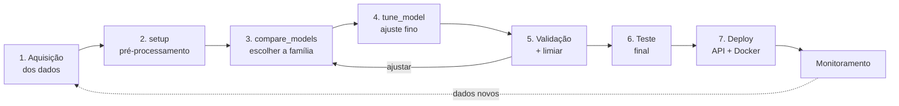

# Aula — AutoML com PyCaret: o mesmo problema, do dado ao deploy

**Disciplina:** ARTIFICIAL INTELLIGENCE e DEEP LEARNING APPLICADA
**Professor:** Dr. Alexandre Miguel de Carvalho
**Ferramentas:** Python 3.10 · PyCaret 3.3 · scikit-learn 1.4 · LightGBM · FastAPI

---

## 1. Por que esta aula existe

Esta aula resolve **exatamente o mesmo problema** da aula anterior — prever se a
renda anual de uma pessoa passa de US$ 50 mil, com o dataset Adult/Census Income
— mas trocando o PyTorch escrito à mão pelo **PyCaret**, uma biblioteca de
AutoML.

Não é uma repetição. É um experimento controlado: **mesmo dado, mesma partição,
mesma métrica, mesma régua**. O que muda é só a abordagem. Só assim a comparação
mede a abordagem, e não o problema.



As sete etapas continuam as mesmas. O que muda é **quanto código cada uma
custa** — e, mais importante, **quais decisões continuam sendo suas**.

### O que você deve levar desta aula

> **AutoML automatiza a digitação, não o julgamento.**

O PyCaret escreve, em uma chamada, o pré-processamento que você escreveu à mão
na aula passada — 77 linhas de código, mais 32 reimplementadas no servidor. Ele
treina treze famílias de modelo enquanto você toma um café. E ele nunca esquece
de aplicar a mesma transformação no treino e na inferência.

O que ele **não** faz: decidir que `fnlwgt` é peso amostral e precisa sair;
saber que o teste é a partição oficial do UCI; escolher o limiar pelo custo do
erro no seu negócio; perceber que `sex` e `race` levantam uma questão ética.
Essas continuam sendo suas — e são justamente as que decidem se o projeto
presta.

### Resultado, de saída

| | MLP (aula anterior) | **PyCaret (esta aula)** |
|---|---|---|
| Modelo publicado | MLP 95→64→32→1, 8.353 parâmetros | **LightGBM ajustado** |
| Código de pré-processamento | 109 linhas — 77 no treino + 32 **reescritas** no servidor | **41 linhas, sem duplicação** |
| AUC-ROC no teste | 0,9053 | **0,9275** |
| F1 no teste | 0,682 | **0,721** |
| Acurácia no teste | 83,31% | **86,71%** |
| Tempo até o modelo treinado | ~20 s | ~190 s (13 famílias + 100 ajustes) |
| Artefatos para produção | 3 arquivos + preproc. reimplementado | **1 arquivo** |
| Tamanho da imagem Docker | ~300 MB | ~1,5 GB (estimado — meça a sua) |

O AutoML ganhou em qualidade do modelo e em segurança de deploy, e perdeu em
custo de inferência e tamanho de imagem. O que ele **não** ganhou foi tamanho de
projeto: medindo código efetivo, este repositório tem 1.315 linhas contra 1.205
do MLP. A §7 destrincha esse balanço — e explica por que **nenhuma das duas
colunas é "a resposta certa"**.

---

## 2. Objetivos de aprendizagem

Ao final da aula, o estudante deve ser capaz de:

1. **Traduzir** um pipeline de pré-processamento tabular escrito à mão nos
   argumentos correspondentes do `setup()`, e explicar o que cada argumento faz.
2. **Distinguir** transformações **com estado** (aprendem dos dados: mediana,
   média, categorias) de transformações **sem estado** (log1p), e decidir a
   partir daí o que pode ou não ocorrer antes da separação treino/teste.
3. **Executar** uma comparação de modelos com validação cruzada e **ler a
   tabela**: por que ordenar por AUC e não por acurácia, e por que o
   `DummyClassifier` precisa estar nela.
4. **Interpretar** uma busca de hiperparâmetros — incluindo o caso em que o
   modelo de fábrica vence a busca — e justificar `choose_better=True`.
5. **Escolher** o limiar de decisão na validação, e explicar por que o
   `predict_model` cortando em 0,5 é uma decisão de negócio tomada por omissão.
6. **Comparar** duas leituras de importância (permutação x nativa do modelo) e
   explicar por que discordam.
7. **Publicar** o pipeline como serviço e **medir** o custo de cada caminho de
   inferência (`predict_model` x `predict_proba` x lote).
8. **Argumentar**, com números, quando usar AutoML e quando escrever o modelo à
   mão.

---

## 3. Preparação do ambiente

```bash
conda activate caret          # ambiente já existente nesta máquina (Python 3.10)
cd caminho/para/pycaret
pip install -r requirements.txt
```

Verificação rápida:

```bash
python -c "import pycaret, sklearn, pandas; print(pycaret.__version__, sklearn.__version__, pandas.__version__)"
# 3.3.2 1.4.2 2.1.4
```

> **Por que um ambiente separado do `p_312`.** O PyCaret 3.3 fixa faixas
> estreitas de versão de `scikit-learn`, `numpy` e `pandas`. Instalá-lo junto do
> ambiente do PyTorch costuma quebrar os dois. Ambiente por projeto não é
> preciosismo — é o que torna o resultado reproduzível.

> **Windows:** se os acentos aparecerem quebrados no terminal, rode `chcp 65001`
> ou defina `set PYTHONIOENCODING=utf-8` antes dos scripts.

### Estrutura do projeto

```
pycaret/
├── README.md                  <- esta aula
├── exercicios.md              <- atividades e rubrica de avaliação
├── requirements.txt
├── src/
│   ├── config.py              <- ETAPA 0: colunas, parâmetros do setup, caminhos
│   ├── utils.py               <- métricas (sklearn), limiar e gráficos
│   ├── data.py                <- ETAPA 1: download + partição + log1p
│   ├── setup_experimento.py   <- ETAPA 2: o pré-processamento inteiro, em 1 chamada
│   ├── comparar.py            <- ETAPA 3: compare_models (13 famílias, 5 dobras)
│   ├── train.py               <- ETAPAS 4 e 5: tune_model + validação + limiar
│   ├── evaluate.py            <- ETAPA 6: teste, métricas, importâncias
│   ├── predict.py             <- inferência em cadastros novos
│   └── export_model.py        <- ETAPA 7-A: pipeline.pkl + metadados.json
├── deploy/
│   ├── api.py                 <- ETAPA 7-B: serviço FastAPI
│   ├── testar_api.py          <- teste de integração do serviço
│   └── Dockerfile             <- ETAPA 7-C: contêiner
├── data/                      <- dataset (baixado automaticamente)
└── outputs/                   <- modelos, gráficos e métricas gerados
```

---

## 4. Fundamentos: o que o AutoML faz, e o que ele não faz

### 4.1 O mapa das funções

O PyCaret organiza um projeto de classificação em meia dúzia de verbos. Ao lado,
o que cada um substitui da aula de MLP:

| Função do PyCaret | O que faz | O que substitui na aula anterior |
|---|---|---|
| `setup(...)` | Monta o `Pipeline` de pré-processamento, ajustado só no treino, e define a validação cruzada | A classe `Preprocessador` inteira + `obter_dataloaders` |
| `compare_models(...)` | Treina N famílias com validação cruzada e ordena | A escolha manual da arquitetura |
| `create_model('lr')` | Treina um modelo específico com validação cruzada | `criar_modelo()` + o laço de treino |
| `tune_model(m)` | Busca hiperparâmetros por validação cruzada | Ajustar `lr`, `dropout`, camadas na mão |
| `blend_models([...])` | Combina modelos por voto | (não existia) |
| `calibrate_model(m)` | Reescala as probabilidades | (não existia) |
| `predict_model(m, data)` | Aplica o pipeline + o modelo a dados novos | `Preprocessador.transform` + `modelo(x)` + `sigmoid` |
| `save_model(m)` | Serializa **pipeline + modelo** num `.pkl` | `torch.jit.trace` + `preprocessador.json` + `metadados.json` |

Repare no que **não** tem equivalente na coluna da direita: `blend_models` e
`calibrate_model`. E no que não tem equivalente na coluna da esquerda: **a
escolha do limiar**. Ela continua sendo trabalho seu, em `train.py`.

### 4.2 O `setup()`: 77 linhas viram 20 argumentos

Este é o coração da aula. Compare os dois lados:

```python
# AULA DE MLP — src/data.py, classe Preprocessador
def fit(self, df):
    for coluna in COLUNAS_NUMERICAS:
        self.medianas[coluna] = float(df[coluna].median())
    for coluna in COLUNAS_CATEGORICAS:
        ...ordenar categorias, garantir "Desconhecido"...
    numerico = self._numerico_bruto(df)
    for coluna in COLUNAS_NUMERICAS:
        self.media[coluna] = float(numerico[coluna].mean())
        self.desvio[coluna] = ...
    self.nomes_features = ...
# + transform(), + to_dict(), + from_dict(), + a reimplementação em numpy no servidor
```

```python
# ESTA AULA — src/setup_experimento.py
exp.setup(
    data=df_treino, test_data=df_val, target="y",
    numeric_features=COLUNAS_NUMERICAS,
    categorical_features=COLUNAS_CATEGORICAS,
    imputation_type="simple", numeric_imputation="median",
    max_encoding_ohe=50,
    normalize=True, normalize_method="zscore",
    fold=5, fold_strategy="stratifiedkfold",
    session_id=42,
)
```

São **77 linhas de código** de um lado e **28 do outro** (medido sem comentários
nem docstrings). Mas o número que importa é outro: na aula de MLP, essas 77
linhas precisavam ser **reescritas em numpy no servidor** — mais 32 linhas, uma
segunda implementação da mesma regra. Duas implementações da mesma regra sempre
acabam divergindo.

Aqui a segunda implementação **não existe**: o servidor recebe o objeto pronto.

**Três armadilhas do `setup()` que a documentação não grita:**

**a) `max_encoding_ohe=25` é o padrão — e é uma bomba silenciosa.** Colunas
categóricas com mais de 25 valores distintos deixam de ser one-hot e passam a
*target encoding* (a categoria é substituída pela média do alvo naquela
categoria). `native-country` tem 42 categorias. Sem mexer nesse argumento, essa
coluna entraria num esquema completamente diferente **sem nenhum aviso** — e
target encoding mal implementado é uma fonte clássica de vazamento. Aqui
forçamos `50` para ter one-hot em tudo, que é o que torna a comparação com o MLP
honesta.

**b) `data` + `test_data` é o que reserva o teste.** Entregamos treino e
validação; o teste oficial do UCI nunca é visto pelo experimento. Se você chamar
`setup(data=dataset_completo)`, o PyCaret separa um hold-out aleatório — e você
perde tanto a partição oficial quanto o controle sobre o que foi visto.

**c) O tipo das colunas é decisão sua.** Sem `numeric_features` e
`categorical_features` explícitos, o PyCaret infere pelo dtype. Uma coluna de
CEP ou de código de produto chega como inteiro e vira "numérica" — e o modelo
passa a achar que o CEP 01310 é menor que o 90210 em algum sentido útil.

### 4.3 Vazamento: com estado x sem estado

A regra de ouro da aula anterior continua valendo, mas agora dá para enunciá-la
com precisão:

> Uma transformação **com estado** aprende parâmetros dos dados (mediana, média,
> desvio, lista de categorias, média do alvo por categoria). Ela **tem** que ser
> ajustada só no treino.
>
> Uma transformação **sem estado** é uma função fixa, linha a linha (`log1p`,
> `x²`, `dia_da_semana(data)`). Ela pode ser aplicada quando quiser.

Neste projeto, `log1p` de `capital-gain`/`capital-loss` é aplicado em
`data.py`, **antes** da separação — e isso está correto, porque `log1p(x)` dá o
mesmo resultado independentemente das outras linhas.

Já a padronização fica dentro do pipeline. A prova aparece rodando
`python src/setup_experimento.py`:

```
age              treino: média -0.000 desvio 1.000   |   validação: média -0.008 desvio 0.995
capital-gain     treino: média -0.000 desvio 1.000   |   validação: média -0.022 desvio 0.962
```

Na validação **não** dá exatamente 0 e 1 — e é assim que tem que ser. Se desse,
haveria vazamento.

> **Mas cuidado com a outra ponta.** Tudo o que você deixa **fora** do pipeline
> vira responsabilidade de quem chama o modelo — inclusive do servidor. O
> `log1p` é a única transformação fora daqui, e mesmo assim ela reaparece em
> `deploy/api.py`, em três linhas, com um comentário grande explicando por quê.
> Esse é o preço, e ele é pequeno **porque é só uma transformação**. O
> exercício 3.2 pede para mover o `log1p` para dentro do pipeline e descobrir o
> que quebra.

### 4.4 Validação cruzada em vez de curva de treino

Na aula de MLP, a ETAPA 5 era ler `curvas_treino.png`: perda de treino x perda
de validação, época a época. Aqui não há épocas, e o gráfico não existe.

O que existe é **validação cruzada estratificada de 5 dobras**: o conjunto de
treino é dividido em 5 partes; o modelo é treinado 5 vezes, cada uma deixando
uma parte de fora, e as 5 medidas viram média e desvio.

| | Partição fixa (MLP) | Validação cruzada (aqui) |
|---|---|---|
| Quantos treinos | 1 | k (=5) |
| O que você vê | uma curva ao longo do tempo | uma média e um **desvio** |
| Diagnostica overfitting? | sim, olhando as duas curvas | só indiretamente (treino x dobras) |
| Custo | 1× | 5× |
| Melhor para | acompanhar o aprendizado | **comparar modelos** |

O **desvio entre dobras** é a informação que a média esconde, e ele resolve uma
discussão que aparece toda semana em projeto real. Veja a saída do `train.py`:

```
Fold  Accuracy     AUC  Recall   Prec.      F1
0       0.8727  0.9265  0.6635  0.7754  0.7151
...
Mean    0.8740  0.9281  0.6641  0.7802  0.7174
Std     0.0027  0.0016  0.0049  0.0107  0.0046
```

O desvio do AUC é **0,0016**. Logo, uma diferença de 0,001 entre dois modelos
não é diferença nenhuma — é ruído. No ranking completo, LightGBM e XGBoost
empatam em 0,9276: escolher entre eles pelo quarto decimal é superstição, não
método.

### 4.5 Por que boosting ganha em dados tabulares

O ranking desta aula reproduz um resultado bem estabelecido: **árvores com
boosting batem redes neurais em dados tabulares**. Três motivos, todos visíveis
no dataset Adult:

1. **Fronteiras de decisão em degraus.** Renda salta em torno de limites
   ("mais de 12 anos de estudo", "mais de 40 h/semana"). Uma árvore representa
   isso com um corte; uma rede precisa aproximar o degrau com muitos neurônios.
2. **Robustez a colunas irrelevantes.** `native-country` tem 42 categorias e
   importância praticamente nula (veja a §5, ETAPA 6). A árvore simplesmente não
   a escolhe. O MLP tem um peso para cada uma das 42 colunas, e todos precisam
   ser aprendidos até chegarem perto de zero.
3. **Invariância a escala monotônica.** Árvore não se importa se você aplicou
   `log1p` ou não — só a ordem importa. Para o MLP, a escala é decisiva.

Grinsztajn et al. (2022) formalizam esses três pontos. A conclusão prática:
**quem começa um projeto tabular por deep learning normalmente está começando
pelo lugar errado.** Isso foi dito na aula de MLP; aqui está o número.

---

## 5. O pipeline, etapa por etapa

Todas as saídas abaixo são **reais**, obtidas com `session_id=42` nesta máquina.

### ETAPA 1 — Aquisição e particionamento

**Arquivo:** [src/data.py](src/data.py) · **Comando:** `python src/data.py`

```
========================================================================
Treino    :  26049 linhas | 24.1% da classe >50K
Validação :   6512 linhas | 24.1% da classe >50K
Teste     :  16281 linhas | 23.6% da classe >50K
========================================================================

Valores ausentes no arquivo original (marcados como '?'):
  workclass            1836  (5.6%)
  occupation           1843  (5.7%)
  native-country        583  (1.8%)
  -> preenchidos com a categoria 'Desconhecido' em data.py

Cardinalidade das colunas categóricas (no treino):
  workclass            9 categorias distintas
  ...
  native-country      42 categorias distintas
  -> 86 colunas one-hot + 5 numéricas = 91 features (o setup() confirma)

Efeito do log1p (transformação SEM ESTADO, aplicada antes de separar):
  capital-gain bruto : min 0 | máx 99999 | 91.7% de zeros
  capital-gain log1p : min 0.00 | máx 11.51
```

**As partições são idênticas às da aula de MLP** — mesma semente, mesmo
algoritmo de separação estratificada, mesma partição oficial do UCI. É isso que
autoriza comparar os dois resultados finais.

As duas armadilhas do arquivo continuam lá e continuam tratadas: a linha de
comentário no topo de `adult.test` e o rótulo com ponto final (`>50K.`).

### ETAPA 2 — Pré-processamento (o `setup()`)

**Arquivo:** [src/setup_experimento.py](src/setup_experimento.py) ·
**Comando:** `python src/setup_experimento.py`

```
                    Description             Value
0                    Session id                42
3           Original data shape       (32561, 13)
5   Transformed train set shape       (26049, 90)
6    Transformed test set shape        (6512, 90)
7              Numeric features                 5
8          Categorical features                 7
11           Numeric imputation            median
13     Maximum one-hot encoding                50
15                    Normalize              True
17               Fold Generator   StratifiedKFold
18                  Fold Number                 5

O PIPELINE MONTADO (um sklearn.Pipeline comum)
  numerical_imputer            TransformerWrapper
  categorical_imputer          TransformerWrapper
  ordinal_encoding             TransformerWrapper
  onehot_encoding              TransformerWrapper
  normalize                    TransformerWrapper
  clean_column_names           TransformerWrapper

Matriz de treino    : (26049, 90)
```

**90 features aqui, 95 na aula de MLP — e a diferença é instrutiva.** As duas
implementações fazem a mesma coisa, com duas convenções diferentes:

| Diferença | MLP | PyCaret | Efeito |
|---|---|---|---|
| Coluna binária `sex` | duas colunas one-hot | **uma** coluna ordinal (0/1) | −1 |
| Categoria `Desconhecido` | criada sempre, mesmo sem ausentes na coluna | criada só onde aparece | −4 |
| | | | **95 → 90** |

Nenhuma das duas está errada. Para `sex`, uma coluna 0/1 carrega exatamente a
mesma informação que duas colunas complementares — a segunda é redundante. Já a
categoria `Desconhecido` sempre presente é uma escolha defensiva do MLP: se em
produção chegar um cadastro com `race` em branco, a coluna existe. No PyCaret,
esse caso cai na imputação. **Vale discutir qual convenção você prefere no seu
domínio** — e é exatamente isso que o exercício 1.3 pede.

> **Não confie na configuração que você escreveu: confira o que a biblioteca
> entendeu.** É para isso que serve rodar este script antes de treinar. Aluno
> que pula esta etapa descobre em produção que `native-country` virou target
> encoding.

### ETAPA 3 — `compare_models`: escolher a família

**Arquivo:** [src/comparar.py](src/comparar.py) · **Comando:** `python src/comparar.py`

```
==============================================================================================
RANKING COMPLETO POR AUC — validação cruzada de 5 dobras estratificadas, no TREINO
==============================================================================================
                              Model  Accuracy     AUC  Recall   Prec.      F1   Kappa     MCC  TT (Sec)
10  Light Gradient Boosting Machine    0.8736  0.9276  0.6604  0.7811  0.7156  0.6351  0.6389     0.490
11        Extreme Gradient Boosting    0.8717  0.9276  0.6609  0.7735  0.7127  0.6308  0.6341     0.388
9      Gradient Boosting Classifier    0.8655  0.9210  0.6083  0.7849  0.6853  0.6015  0.6095     1.158
8              Ada Boost Classifier    0.8610  0.9154  0.6169  0.7607  0.6812  0.5936  0.5990     0.704
1               Logistic Regression    0.8448  0.8977  0.5941  0.7135  0.6483  0.5497  0.5536     0.986
2                  Ridge Classifier    0.8418  0.8937  0.5385  0.7336  0.6210  0.5240  0.5340     0.792
6          Random Forest Classifier    0.8495  0.8920  0.6244  0.7148  0.6664  0.5699  0.5721     0.834
12                   MLP Classifier    0.8371  0.8797  0.6257  0.6748  0.6491  0.5433  0.5441    10.494
7            Extra Trees Classifier    0.8303  0.8511  0.5954  0.6650  0.6282  0.5187  0.5201     1.064
5            K Neighbors Classifier    0.8236  0.8437  0.5788  0.6502  0.6124  0.4987  0.5001     0.928
4          Decision Tree Classifier    0.8180  0.7635  0.6072  0.6259  0.6163  0.4971  0.4972     0.274
3                       Naive Bayes    0.4041  0.6722  0.9719  0.2850  0.4405  0.1083  0.2187     0.280
0                  Dummy Classifier    0.7592  0.5000  0.0000  0.0000  0.0000  0.0000  0.0000     1.052
==============================================================================================
Tempo total: 104.5 s (13 modelos x 5 dobras = 65 treinos)

Linha de base trivial (Dummy): acurácia 75.92%, AUC 0.5000
Melhor modelo (Light Gradient Boosting Machine): acurácia 87.36%, AUC 0.9276
Ganho real sobre o trivial: +11.44 pontos de acurácia
```

**Seis leituras que valem mais do que o primeiro lugar:**

1. **O `Dummy` é a régua.** 75,92% de acurácia com zero aprendizado — e AUC
   0,500, revocação 0,000. Ele não encontra *ninguém*. Qualquer celebração de
   acurácia que não mencione essa linha está incompleta.
2. **Os quatro primeiros são todos boosting.** Não é coincidência: é a §4.5.
3. **O `MLP Classifier` fica em oitavo, com AUC 0,8797.** É a mesma família da
   aula anterior — e, sem o cuidado artesanal que dedicamos a ela lá
   (`pos_weight`, escolha de checkpoint por AUC, early stopping), rende menos.
   Note também que é o **modelo mais lento da tabela**, 10,5 s contra 0,49 s do
   LightGBM: 21 vezes mais caro para ficar 0,048 de AUC atrás.
4. **O `Naive Bayes` tem revocação 0,9719 e acurácia 40%.** Ele diz "sim" para
   quase todo mundo. É o retrato de por que revocação sozinha também mente — o
   par precisão/revocação só significa alguma coisa junto.
5. **`Ridge Classifier` aparece com AUC 0,8937** apesar de não produzir
   probabilidade calibrada — o PyCaret usa a função de decisão para ordenar. Ele
   serve para ranquear, **não** para responder "qual a probabilidade".
6. **LightGBM e XGBoost empatam em 0,9276.** Com desvio entre dobras de 0,0016,
   escolher entre os dois pelo AUC é escolher por ruído. O critério de desempate
   passa a ser outro: velocidade, tamanho do artefato, familiaridade da equipe.

> **Por que ordenar por AUC e não por acurácia.** Rode
> `python src/comparar.py --metrica Accuracy` e veja o `Dummy` subir várias
> posições. Com 24% de positivos, acurácia recompensa quem ignora a classe
> minoritária. AUC mede a qualidade do **ordenamento** e não depende do limiar —
> é a métrica certa para *selecionar* modelo quando a decisão final ainda vai
> ser calibrada.

O gráfico `outputs/ranking_modelos.png` traz a mesma tabela em barras, com o
`Dummy` destacado em vermelho.

### ETAPA 4 — `tune_model`: o ajuste fino

**Arquivo:** [src/train.py](src/train.py) · **Comando:** `python src/train.py`

O `train.py` refaz o `compare_models`, pega o campeão e ajusta:

```
==============================================================================================
2) AJUSTE FINO (tune_model) — 20 combinações sorteadas, otimizando AUC
==============================================================================================
São 20 x 5 = 100 treinos. Isto costuma ser a parte mais cara do pipeline.

Desempenho do modelo final, dobra a dobra:
      Accuracy     AUC  Recall   Prec.      F1   Kappa     MCC
Fold
0       0.8727  0.9265  0.6635  0.7754  0.7151  0.6338  0.6370
1       0.8743  0.9260  0.6598  0.7841  0.7166  0.6366  0.6405
2       0.8706  0.9293  0.6709  0.7634  0.7142  0.6310  0.6332
3       0.8735  0.9286  0.6582  0.7822  0.7148  0.6343  0.6382
4       0.8789  0.9299  0.6683  0.7958  0.7265  0.6494  0.6535
Mean    0.8740  0.9281  0.6641  0.7802  0.7174  0.6370  0.6405
Std     0.0027  0.0016  0.0049  0.0107  0.0046  0.0065  0.0069

As 5 melhores das 20 combinações sorteadas (AUC médio nas 5 dobras):

   #      AUC   desvio   hiperparâmetros
   1  0.9281  0.0016   bagging_fraction=0.8, bagging_freq=6, feature_fraction=0.4, learning_rate=0.1, ...
   2  0.9271  0.0011   bagging_fraction=0.8, bagging_freq=3, feature_fraction=0.8, learning_rate=0.2, ...
   3  0.9253  0.0014   bagging_fraction=0.6, bagging_freq=3, feature_fraction=0.4, learning_rate=0.4, ...
   4  0.9246  0.0017   bagging_fraction=0.8, bagging_freq=7, feature_fraction=0.8, learning_rate=0.4, ...
   5  0.9237  0.0024   bagging_fraction=0.6, bagging_freq=3, feature_fraction=0.7, learning_rate=0.2, ...

  pior das 20: 0.8839  |  melhor: 0.9281  |  amplitude da busca: 0.0442

AUC (validação cruzada) do modelo publicado: 0.9281
A busca VENCEU o modelo de fábrica. Hiperparâmetros alterados:
  min_child_samples                  20  ->  61
  min_split_gain                    0.0  ->  0.2
  n_estimators                      100  ->  250
  num_leaves                         31  ->  20
  reg_alpha                         0.0  ->  0.7
  reg_lambda                        0.0  ->  0.1
```

**O que ler nesses números:**

- **O ganho do ajuste foi +0,0005 de AUC** (0,9276 → 0,9281), contra um desvio
  entre dobras de 0,0016. Ou seja: **o ajuste fino, aqui, não fez diferença
  estatística nenhuma.** Cem treinos para ganhar um terço de um desvio-padrão.
  Reportar isso honestamente vale mais do que apresentar "modelo otimizado".
- **A amplitude da busca foi 0,0442** — da pior combinação (0,8839) à melhor
  (0,9281). Hiperparâmetros ruins destroem muito mais desempenho do que
  hiperparâmetros ótimos acrescentam. É por isso que a busca vale a pena mesmo
  quando o ganho é pequeno: ela é um seguro, não um investimento.
- **Todas as alterações apontam para mais regularização**: menos folhas (31→20),
  mais amostras mínimas por folha (20→61), `reg_alpha` de 0 para 0,7. A busca
  concluiu, sozinha, que o modelo de fábrica estava decorando um pouco. É o
  mesmo diagnóstico que na aula de MLP você faria olhando a curva de validação
  subir.

> **`choose_better=True` merece um parágrafo.** A busca aleatória testa 20
> combinações e devolve a melhor **delas** — que pode perfeitamente ser pior que
> o padrão da biblioteca. Com `choose_better=True`, o PyCaret compara o ajustado
> com o original e devolve o melhor dos dois. Sem isso, é comum "ajustar" um
> modelo e publicar uma versão pior sem perceber. Rode
> `python src/train.py --modelo lightgbm --rapido` algumas vezes e você verá os
> dois desfechos.

### ETAPA 5 — Validação e escolha do limiar

Ainda em `train.py`, e **esta é a etapa que o AutoML não faz por você**:

```
========================================================================
VALIDAÇÃO — 6512 pessoas (nunca usada para ajustar pesos)
========================================================================
AUC-ROC 0.9293 | precisão média 0.8281 (linha de base 0.2408)

Limiar 0.50 (o padrão do predict_model):
  acurácia       87.38%
  precisão       0.781
  revocação      0.661
  F1             0.716
  matriz        VN=4654  FP=290  FN=532  VP=1036

Limiar 0.41 (ótimo para F1 NA VALIDAÇÃO):
  acurácia       86.93%
  precisão       0.728
  revocação      0.730
  F1             0.729
  matriz        VN=4517  FP=427  FN=424  VP=1144

Ganho de F1 ao escolher o limiar: +0.0129
O AUC é IDÊNTICO nos dois casos — o limiar não muda o modelo,
apenas onde você corta a mesma lista ordenada.
```

`predict_model` corta em **0,5 sem perguntar nada a você**. Não há nada de
especial em 0,5 num problema com 24% de positivos: é apenas o meio do intervalo.
Baixar para 0,41 troca 137 verdadeiros negativos por 109 verdadeiros positivos —
menos alarmes falsos evitados, mais gente encontrada.

**Qual dos dois é o certo depende do custo do erro, e isso é decisão de negócio,
não de estatística.** Numa triagem de fraude, um falso negativo custa caro e você
desce o limiar. Numa aprovação automática de crédito, um falso positivo custa
caro e você sobe.

**A calibração vem de brinde.** `outputs/calibracao.png` mostra o diagrama de
confiabilidade na validação:

| faixa prevista | probabilidade média prevista | frequência real | n |
|---|---|---|---|
| 0,0–0,1 | 0,021 | 0,020 | 3546 |
| 0,3–0,4 | 0,347 | 0,326 | 331 |
| 0,7–0,8 | 0,746 | 0,748 | 238 |
| 0,9–1,0 | 0,981 | 0,991 | 431 |

O modelo é **bem calibrado**: entre os casos a que ele deu 74,6%, 74,8% eram
positivos de verdade. Isso importa quando a probabilidade vira número de negócio
(preço, limite, priorização de fila) e não apenas um ranking.

E é aqui que aparece um efeito colateral que a aula de MLP não podia mostrar:
lá, `pos_weight=3,15` inflava as probabilidades para forçar revocação, o que
**estraga a calibração**. Aqui não usamos reponderação nenhuma — usamos o
limiar. Ligue o SMOTE com `python src/train.py --balancear` e veja a curva de
calibração descolar da diagonal, com o AUC praticamente parado. Esse é o
exercício 2.4.

### ETAPA 6 — Teste final

**Arquivo:** [src/evaluate.py](src/evaluate.py) · **Comando:** `python src/evaluate.py`

```
Modelo publicado: LGBMClassifier
AUC de validação registrado no treino: 0.9293
Limiar de decisão: 0.41 (escolhido na validação)

========================================================================
TESTE — 16281 pessoas (usado UMA única vez)
========================================================================
AUC-ROC                0.9275   (0,5 = chute)
Precisão média (AUC-PR)  0.8255   (linha de base = 0.2362)

No limiar 0.41:
  acurácia       86.71%
  precisão       0.716   (dos previstos >50K, quantos eram)
  revocação      0.725   (dos >50K reais, quantos achei)
  F1             0.721
  especificidade 0.911   (dos <=50K reais, quantos acertei)
  matriz        VN=11328  FP=1107  FN=1056  VP=2790

Linhas de base:
  chutar sempre '<=50K'  -> acurácia 76.38%, revocação 0,000 (não encontra ninguém)
  chutar ao acaso        -> AUC 0,500

Para comparação, no limiar padrão 0.50:
  acurácia       87.34%
  precisão       0.774
  revocação      0.655
  F1             0.710
  matriz        VN=11699  FP=736  FN=1325  VP=2521
```

**Validação 0,9293 → teste 0,9275.** A queda de 0,0018 é a estimativa honesta do
quanto o processo inteiro (escolher família, ajustar hiperparâmetros, escolher
limiar) se ajustou à validação. É pequena porque a validação tem 6.512 linhas e
tomamos poucas decisões. Em projeto com centenas de experimentos, essa queda é
bem maior — e por isso o teste tem que ficar guardado.

**Leia a linha de base antes de comemorar os 86,7%.** O modelo trivial acerta
76,38%. O ganho de 10,3 pontos é real, mas o que separa mesmo os dois modelos é
a revocação: **0,725 contra 0,000**.

**O limiar move precisão e revocação em direções opostas:**

| Limiar | Acurácia | Precisão | Revocação | F1 | AUC |
|---|---|---|---|---|---|
| 0,50 (padrão) | **87,34%** | **0,774** | 0,655 | 0,710 | 0,9275 |
| **0,41** (escolhido) | 86,71% | 0,716 | **0,725** | **0,721** | 0,9275 |

O AUC é **idêntico**: o limiar não muda o modelo, apenas onde você corta a mesma
lista ordenada.

**Importância por permutação — nas colunas do cadastro:**

```
marital-status     queda de AUC +0.0617  (+/- 0.0024)
capital-gain       queda de AUC +0.0587  (+/- 0.0012)
age                queda de AUC +0.0366  (+/- 0.0030)
education-num      queda de AUC +0.0254  (+/- 0.0003)
occupation         queda de AUC +0.0141  (+/- 0.0008)
capital-loss       queda de AUC +0.0140  (+/- 0.0014)
hours-per-week     queda de AUC +0.0109  (+/- 0.0004)
relationship       queda de AUC +0.0059  (+/- 0.0009)
sex                queda de AUC +0.0027  (+/- 0.0003)
workclass          queda de AUC +0.0014  (+/- 0.0003)
race               queda de AUC +0.0004  (+/- 0.0002)
native-country     queda de AUC +0.0000  (+/- 0.0003)
```

Quatro observações obrigatórias:

- **`native-country` custa 42 colunas e vale 0,0000 de AUC.** Removê-la
  simplificaria o modelo sem perda mensurável. Esse é o tipo de conclusão que
  só aparece quando você mede.
- **`marital-status` em primeiro lugar merece discussão.** Ser casado não
  *causa* renda alta; a variável está capturando estrutura social do censo de
  1994. **Importância não é causalidade.**
- **`sex` aparece com importância baixa (0,0027) — e isso não inocenta o
  modelo.** Colunas correlacionadas dividem a importância entre si: embaralhar
  `sex` deixa a informação disponível em `relationship` (`Husband` / `Wife`) e
  em `occupation`. É exatamente o conceito de *proxy*, e é o que o exercício 3.4
  investiga.
- **Compare com a lista da aula de MLP**, que permutava as 95 colunas
  *transformadas* e via `education-num` em primeiro. Aqui permutamos as 12
  colunas *originais*, o que agrega as 7 colunas de `marital-status` numa só e
  muda a ordem. Nenhuma das duas está errada — elas respondem a perguntas
  diferentes: "que coluna interna o modelo usou" x "que campo do formulário
  importa".

O script também imprime a **importância nativa** do LightGBM (nas 90 colunas
transformadas), onde `age` e `hours-per-week` lideram. Ela discorda da
permutação porque mede outra coisa: quanto a coluna foi *usada* nos cortes, não
quanto ela *faz falta*.

**Referências para comparar seu resultado:**

| Abordagem | Onde foi medido | Acurácia | AUC |
|---|---|---|---|
| Chutar sempre `<=50K` | teste | 76,4% | 0,500 |
| MLP artesanal (aula anterior) | **teste** | 83,3% | 0,905 |
| **LightGBM ajustado (esta aula)** | **teste** | **86,7%** | **0,927** |
| Regressão logística | validação cruzada, treino | 84,5% | 0,898 |
| `MLPClassifier` do sklearn | validação cruzada, treino | 83,7% | 0,880 |

> Só as três primeiras linhas são medidas no conjunto de teste. As duas últimas
> vêm da tabela do `compare_models`, que roda validação cruzada **no treino** —
> compará-las diretamente com um número de teste é o tipo de descuido que enche
> relatório de conclusão errada. Estão aqui como referência de ordem de
> grandeza, não como resultado final.

### ETAPA 7 — Deploy

#### 7-A. Exportar o modelo

```bash
python src/export_model.py
```

```
[ok] Pipeline salvo em outputs/pipeline_renda.pkl
[ok] Metadados salvos em outputs/metadados.json
     modelo publicado : LGBMClassifier
     limiar publicado : 0.41
     tamanho do artefato: 570.0 KB

     diferença máxima original vs. recarregado: 0.00e+00 (OK)

     Ambiente que produziu este artefato (grave junto com ele):
       python         3.10.16
       pycaret        3.3.2
       scikit-learn   1.4.2
       numpy          1.26.4
       lightgbm       4.5.0

     Passos do pipeline que foram serializados:
       numerical_imputer          TransformerWrapper
       categorical_imputer        TransformerWrapper
       ordinal_encoding           TransformerWrapper
       onehot_encoding            TransformerWrapper
       normalize                  TransformerWrapper
       clean_column_names         TransformerWrapper
       trained_model              LGBMClassifier
```

**Este é o ponto alto da abordagem.** Na aula de MLP, o pacote de produção tinha
três arquivos que precisavam viajar juntos, e publicar só o primeiro era o erro
nº 1. Aqui o pré-processamento **está dentro do artefato**, ajustado no treino.
Não há como servir o modelo com a transformação errada.

**E este é o preço:**

| | TorchScript (MLP) | pickle do PyCaret (aqui) |
|---|---|---|
| Precisa do código-fonte? | não | **sim** (classes do pycaret e do lightgbm) |
| Precisa das mesmas versões? | tolerante | **sim** — e a falha pode ser silenciosa |
| Roda fora do Python? | sim (C++) | não |
| Executa código ao carregar? | não | **sim** (pickle é código) |
| Pré-processamento junto? | não (3 arquivos) | **sim** (1 arquivo) |
| Imagem Docker | ~300 MB | ~1,5 GB (estimativa) |

Trocamos "pré-processamento que pode divergir" por "dependência de versões e
formato que executa código". É por isso que `metadados.json` grava as versões:
é o que permite reconstruir o ambiente daqui a seis meses, quando o modelo der
um número estranho.

**A regra de ouro do deploy continua valendo:** o script recarrega o arquivo e
exige que as probabilidades batam (aqui, diferença exatamente 0,00). **Nunca
confie numa exportação sem comparar as saídas.**

#### 7-B. Servir como API

```bash
python -m uvicorn deploy.api:app --reload --port 8000
```

- <http://127.0.0.1:8000> — formulário de teste
- <http://127.0.0.1:8000/docs> — documentação interativa (Swagger)
- `GET /saude` — *health check*, que devolve inclusive as versões do treino
- `POST /prever` — um cadastro
- `POST /prever_lote` — N cadastros de uma vez

```bash
curl -X POST http://127.0.0.1:8000/prever -H "Content-Type: application/json" \
  -d '{"age":45,"workclass":"Private","education-num":13,
       "marital-status":"Married-civ-spouse","occupation":"Exec-managerial",
       "relationship":"Husband","race":"White","sex":"Male","capital-gain":0,
       "capital-loss":0,"hours-per-week":50,"native-country":"United-States"}'
```

```json
{"probabilidade_acima_50k": 0.8526, "decisao": ">50K", "limiar": 0.41,
 "confiabilidade": "normal", "modelo": "LGBMClassifier",
 "versao_modelo": "1.0.0", "tempo_inferencia_ms": 25.41}
```

Teste de integração, em outro terminal:

```bash
python deploy/testar_api.py --n 500
```

```
saúde: modelo=LGBMClassifier v1.0.0 limiar=0.41

--------------------------------------------------------------
Amostras     : 500
Acurácia     : 87.60%   (VN=352 FP=26 FN=36 VP=86)
Precisão     : 0.768
Revocação    : 0.705
F1           : 0.735
Latência média: 53.80 ms por registro

F1 offline (evaluate.py): 0.721
F1 pela API            : 0.735   | diferença 0.014
[OK] API e avaliação offline concordam — o pipeline chegou inteiro ao serviço.
```

**Por que este teste continua existindo, se o pipeline agora viaja junto.**
Porque três coisas ainda podem divergir, e nenhuma delas levanta exceção:

1. o `log1p`, que ficou fora do pipeline e é repetido no servidor;
2. nomes e aliases de coluna — mandar `education_num` em vez de `education-num`
   não dá erro, gera uma coluna ausente imputada com a mediana e uma previsão
   silenciosamente pior;
3. versões diferentes de `scikit-learn`/`LightGBM` ao carregar o `.pkl`.

**A lição de desempenho — meça o caminho de inferência.** O mesmo pipeline, três
formas de chamar:

| Caminho | Latência por registro | Observação |
|---|---|---|
| `predict_model(pipeline, data=df)` | ~153 ms (~168 ms via HTTP) | idiomático, mas monta DataFrame anotado e **arredonda para 4 casas** |
| `pipeline.predict_proba(df)` | ~40 ms (~54 ms via HTTP) | o que a API usa |
| `/prever_lote` com 500 registros | **0,068 ms** | mesmo custo fixo, diluído |

Os ~40 ms são custo **fixo por chamada** (montar o DataFrame, atravessar os seis
transformadores), não custo por linha. É por isso que o lote é 790 vezes mais
barato por registro. **Em serviço de ML, o lote quase sempre é a diferença entre
"funciona" e "aguenta produção".**

> Compare com os 0,29 ms por requisição do MLP em TorchScript. O modelo aqui é
> melhor e o deploy é mais simples de acertar, mas a inferência unitária é
> ~180 vezes mais cara. Se o seu caso de uso é uma decisão síncrona dentro de um
> checkout, isso importa; se é um lote noturno de 2 milhões de cadastros, não
> importa nada. **Escolha de arquitetura é uma decisão empírica sobre o seu
> caso, não uma preferência.**

#### 7-C. Empacotar em contêiner

```bash
docker build -t pycaret-renda -f deploy/Dockerfile .
docker run -p 8000:8000 pycaret-renda
```

Entra na imagem apenas o código do serviço e os dois artefatos. Dataset e
scripts de treino ficam de fora. As versões no `Dockerfile` saem de
`outputs/metadados.json` — se não baterem com as do treino, o `.pkl` pode até
carregar e prever diferente, em silêncio.

#### 7-D. E depois do deploy?

O ciclo não termina. Vale tudo o que foi dito na aula de MLP, e mais três coisas
específicas de AutoML:

- **Monitoramento de *drift*** — este modelo foi treinado com o censo de
  **1994**. Aplicá-lo hoje daria resultados sistematicamente errados.
- **Registro de decisões próximas do limiar** — o campo `confiabilidade` existe
  para isso.
- **Versionamento das dependências, não só do modelo.** Um `.pkl` sem o
  ambiente registrado é um artefato que ninguém consegue auditar.
- **Retreino é barato — e isso é uma armadilha.** Com AutoML, refazer o pipeline
  inteiro custa três minutos. A tentação de retreinar toda semana até o número
  subir é real, e é *p-hacking* com outro nome: cada rodada em que você olha o
  teste queima um pouco da sua estimativa honesta.
- **Auditoria de viés.** O modelo aprende `sex` e `race` porque essas colunas
  *correlacionam* com renda no censo de 1994 — reflexo de desigualdade real.
  Usar isso para decidir crédito, contratação ou preço reproduz e automatiza a
  desigualdade, em escala e com aparência de objetividade. E note a agravante
  desta abordagem: **é mais fácil publicar um modelo que você não inspecionou**,
  porque foram quatro chamadas de função. Perguntas obrigatórias antes de
  publicar: (i) a taxa de falsos negativos é igual entre os grupos? (ii) remover
  a coluna resolve, ou o modelo reconstrói o atributo a partir das outras?
  (iii) a decisão é explicável para quem foi afetado por ela? *(Spoiler do
  exercício 3.4: remover a coluna quase não muda o AUC — e é exatamente esse o
  problema.)*

---

## 6. Roteiro de execução completo

```bash
conda activate caret
cd pycaret
pip install -r requirements.txt

python src/data.py                 # 1.  inspecionar dados        (~10 s)
python src/setup_experimento.py    # 2.  conferir o pipeline      (~15 s)
python src/comparar.py --rapido    #     ensaio em sala           (~45 s)
python src/comparar.py             # 3.  ranking completo         (~105 s)
python src/train.py                # 4-5. ajuste + limiar         (~190 s)
python src/evaluate.py             # 6.  teste + importâncias     (~90 s)
python src/export_model.py         # 7A. pipeline.pkl + metadados (~20 s)
python -m uvicorn deploy.api:app --port 8000     # 7B. servidor
python deploy/testar_api.py --n 500              #     (em outro terminal)
python deploy/testar_api.py --n 500 --lote       #     compare a latência
```

Aula de 4 horas cabe folgado. Para a demonstração ao vivo, use `--rapido` em
tudo: o pipeline inteiro roda em menos de dois minutos.

---

## 7. MLP à mão x PyCaret: o balanço

Esta é a seção que justifica as duas aulas existirem.

### 7.1 O placar

| Dimensão | MLP artesanal | PyCaret | Quem ganha |
|---|---|---|---|
| AUC no teste | 0,9053 | **0,9275** | PyCaret |
| F1 no teste | 0,682 | **0,721** | PyCaret |
| Código de pré-processamento | 109 linhas, 32 delas duplicadas no servidor | **41 linhas, sem duplicação** | PyCaret |
| Código efetivo do projeto inteiro | **1.205 linhas** | 1.315 linhas | empate — veja a nota |
| Modelos avaliados | 1 | **13** | PyCaret |
| Tempo até o primeiro número | ~20 s | ~105 s | MLP |
| Risco de divergência treino/produção | alto (reimplementado) | **baixo** (pipeline junto) | PyCaret |
| Latência unitária de inferência | **0,29 ms** | 54 ms | MLP |
| Tamanho da imagem | **~300 MB** | ~1,5 GB (estimativa) | MLP |
| Portabilidade do artefato | **TorchScript, roda em C++** | pickle, preso ao Python | MLP |
| Controle sobre o que acontece | **total** | limitado ao que a API expõe | MLP |
| Facilidade de publicar sem entender | (difícil) | **fácil — e esse é o risco** | MLP |

> **Nota sobre a contagem de linhas, porque ela contraria a propaganda do
> AutoML.** Medindo código efetivo (sem comentários, docstrings e linhas em
> branco), este projeto tem **1.315 linhas** contra **1.205** do MLP. O AutoML
> *não* encolheu o projeto — ele encolheu **uma parte** dele (o
> pré-processamento, de 109 para 41 linhas) e liberou espaço para o resto:
> comparação de 13 famílias, relatório da busca de hiperparâmetros, calibração,
> duas leituras de importância, endpoint de lote. Nada disso existia na aula
> anterior.
>
> A lição: **AutoML não economiza trabalho, ele o realoca** — de digitar
> transformações para analisar resultados. Se o seu projeto com AutoML ficou
> menor, provavelmente você deixou de fazer alguma coisa.

### 7.2 O que o PyCaret genuinamente resolveu

1. **Eliminou a classe de bug mais cara do ML tabular.** O pré-processamento
   viaja com o modelo. O erro nº 1 de deploy da aula anterior deixou de ser
   possível.
2. **Tornou barato testar hipóteses.** Descobrir que boosting bate MLP neste
   dataset custou 105 segundos. Na mão, custaria uma tarde por família.
3. **Trouxe o `Dummy` para dentro do fluxo.** A régua está na tabela por
   construção, não porque alguém lembrou de calculá-la.
4. **Deu métricas que ninguém calcula à mão.** Kappa e MCC saem de graça, e os
   dois descontam o acerto obtido por acaso — coisa que a acurácia não faz.

### 7.3 O que ele não resolveu, e não vai resolver

1. **A definição do problema.** Qual é o alvo, qual coluna é vazamento
   disfarçado, qual é a partição correta, qual erro custa mais caro.
2. **A escolha do limiar.** `predict_model` corta em 0,5 e não avisa.
3. **A leitura das métricas.** Nada impede um relatório que celebra 87% sem
   mencionar que o trivial faz 76%.
4. **A auditoria de viés.** O modelo aprende `sex` e `race` com a mesma
   naturalidade com que aprende `age`.
5. **A honestidade experimental.** Retreinar até o número do teste subir é fácil
   e rápido — e continua sendo errado.

### 7.4 Quando usar cada um

**Use AutoML (PyCaret) quando:** o dado é tabular; você precisa de uma linha de
base sólida rápido; há muitas famílias plausíveis e nenhuma razão forte para
preferir uma; a equipe é pequena e o risco de erro de pré-processamento é alto.

**Escreva à mão (PyTorch) quando:** o dado tem estrutura que exige arquitetura
própria (imagem, texto, série temporal, grafo); a latência ou o tamanho do
artefato são restrições de projeto; você precisa de algo que a biblioteca não
expõe (perda customizada, *embeddings* de categorias, treino distribuído); ou
o objetivo é **aprender como a coisa funciona** — que é o objetivo da aula
anterior, e é o motivo de ela vir primeiro.

> **A ordem das duas aulas não é acidental.** Quem aprende `compare_models()`
> antes de ter escrito um laço de treino não sabe o que está automatizando — e
> não tem como saber quando a automação está errada. AutoML é uma ferramenta
> excelente **para quem já sabe fazer à mão**.

---

## 8. Erros comuns (guia de sobrevivência)

| Sintoma | Causa provável | Correção |
|---|---|---|
| `setup()` reclama de tipo de coluna | Categórica que veio como número, ou o contrário | Declare `numeric_features` e `categorical_features` explicitamente |
| Uma categórica sumiu do one-hot | Cardinalidade acima de `max_encoding_ohe` (padrão 25) → virou target encoding | Aumente `max_encoding_ohe`, ou aceite conscientemente |
| Validação ótima, teste decepcionante | `setup()` recebeu o dataset completo | Passe só o treino em `data=`, e a validação em `test_data=` |
| Acurácia 76% e revocação 0 | Ordenou o `compare_models` por acurácia | Ordene por AUC, e olhe a linha do `Dummy` |
| O modelo "ajustado" ficou pior | `choose_better=False` | Use `choose_better=True`; compare com o desvio entre dobras |
| Todas as decisões saem "não" | Limiar em 0,5 num problema desbalanceado | Escolha o limiar na validação (`melhor_limiar`) |
| Probabilidades deslocadas | `fix_imbalance=True` (SMOTE) estragou a calibração | Prefira ajustar o limiar; ou calibre depois |
| `.pkl` não carrega em produção | Versão diferente de pycaret/sklearn | Confira `metadados.json`; fixe as versões no Dockerfile |
| API responde, mas com F1 muito menor | `log1p` esquecido, ou alias de coluna errado | Rode `deploy/testar_api.py`; compare com o `evaluate.py` |
| API lenta demais | `predict_model` no endpoint, ou uma requisição por registro | Use `predict_proba` e o endpoint de lote |
| Resultado muda a cada execução | `session_id` não fixado | `session_id=42` no `setup()` |
| LightGBM inunda o terminal | Log em C++, nos processos paralelos | Passe a **instância** `LGBMClassifier(verbose=-1)` em vez da sigla |
| `native-country` some do modelo | Categoria nova, não vista no treino | Já tratado pelo pipeline; decida se é o comportamento desejado |

---

## 9. Atividades

As atividades práticas, o desafio final e a rubrica de avaliação estão em
**[exercicios.md](exercicios.md)**.

---

## 10. Glossário

| Termo | Significado |
|---|---|
| **AutoML** | Automação das etapas repetitivas de um projeto de ML: pré-processamento, comparação de modelos, busca de hiperparâmetros |
| **`setup()`** | Função do PyCaret que monta o pipeline de pré-processamento e define a validação |
| **Pipeline** | Sequência de transformações + modelo, tratada como um objeto único |
| **Com estado / sem estado** | Transformação que aprende parâmetros dos dados x função fixa |
| **Validação cruzada (k dobras)** | Treinar k vezes, deixando 1/k de fora a cada vez, e reportar média e desvio |
| **Estratificada** | Cada dobra mantém a proporção original das classes |
| **Boosting** | Somar árvores fracas em sequência, cada uma corrigindo o erro das anteriores |
| **One-hot** | Codificação de categoria em colunas 0/1, uma por valor possível |
| **Target encoding** | Substituir a categoria pela média do alvo naquela categoria |
| **`choose_better`** | Devolver o modelo original se a busca de hiperparâmetros piorou o resultado |
| **Limiar** | Corte que transforma probabilidade em decisão |
| **Calibração** | Grau em que a probabilidade prevista corresponde à frequência real |
| **SMOTE** | Gerar exemplos sintéticos da classe minoritária para equilibrar o treino |
| **Kappa / MCC** | Métricas que descontam o acerto obtido por acaso |
| **Importância por permutação** | Quanto a métrica cai ao embaralhar uma coluna |
| **Proxy** | Coluna que carrega, indiretamente, a informação de outra (removida) |
| **Pickle** | Formato de serialização do Python; executa código ao ser lido |
| **Drift** | Mudança da distribuição dos dados reais ao longo do tempo |

---

## 11. Referências

- Ali, M. **PyCaret: An open source, low-code machine learning library in Python**, 2020. <https://pycaret.org>
- Documentação oficial do PyCaret — <https://pycaret.gitbook.io/docs/>
- API de classificação — <https://pycaret.readthedocs.io/en/latest/api/classification.html>
- Grinsztajn, Oyallon & Varoquaux. *Why do tree-based models still outperform deep learning on tabular data?*, NeurIPS 2022. <https://arxiv.org/abs/2207.08815>
- Ke et al. *LightGBM: A Highly Efficient Gradient Boosting Decision Tree*, NeurIPS 2017.
- Chen & Guestrin. *XGBoost: A Scalable Tree Boosting System*, KDD 2016.
- Becker & Kohavi. *Adult* [Dataset]. UCI Machine Learning Repository, 1996. <https://doi.org/10.24432/C5XW20>
- Niculescu-Mizil & Caruana. *Predicting Good Probabilities With Supervised Learning*, ICML 2005 — sobre calibração.
- Chawla et al. *SMOTE: Synthetic Minority Over-sampling Technique*, JAIR 2002.
- Barocas, Hardt & Narayanan. **Fairness and Machine Learning**. <https://fairmlbook.org>
- Documentação do scikit-learn sobre validação cruzada — <https://scikit-learn.org/stable/modules/cross_validation.html>
