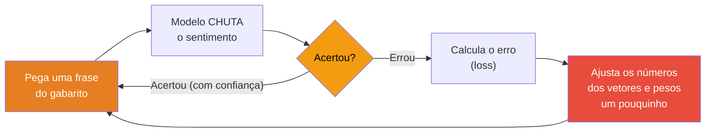
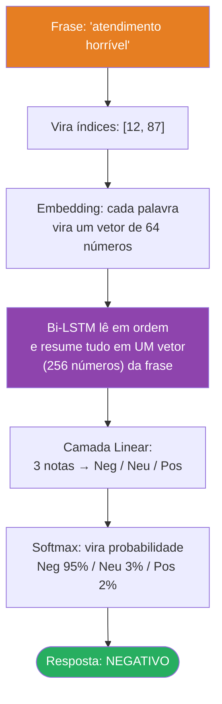
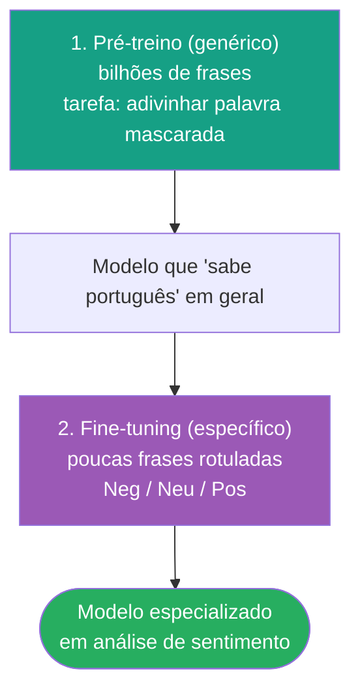

# Adivinhando as Palavras

### Como o modelo "descobre" sozinho quais palavras são positivas ou negativas

> Material didático para iniciantes — acompanha o notebook
> [analise_sentimentos_SAC.ipynb](analise_sentimentos_SAC.ipynb).

---

## A pergunta que todo iniciante faz

Quando você olha o código pela primeira vez, é natural procurar uma lista assim:

```python
palavras_positivas = ["excelente", "ótimo", "maravilhoso"]
palavras_negativas = ["péssimo", "horrível", "ruim"]
```

**Essa lista não existe no projeto.** E isso não é um esquecimento — é o coração da ideia.
O modelo **aprende sozinho** quais palavras indicam cada sentimento. Vamos entender como.

---

## 1. Duas formas de resolver o problema

Imagine que você precisa separar reclamações em **Negativa**, **Neutra** e **Positiva**.

### Jeito A — Escrever regras à mão (o jeito "antigo")

Você mesmo faria a lista de palavras boas e ruins e contaria quantas aparecem:

> "Tem 'horrível'? +1 para negativo. Tem 'excelente'? +1 para positivo."

**Problemas:**
- Você teria que prever **todas** as palavras do português. Impossível.
- Não funciona com "o produto **não** é bom" (tem "bom", mas é negativo!).
- Cada idioma/assunto novo = recomeçar do zero.

### Jeito B — Deixar o computador aprender com exemplos (Deep Learning)

Você dá ao computador **milhares de frases já classificadas por humanos** e deixa que **ele
descubra os padrões**. É o que fazemos no notebook. Nenhuma palavra é marcada à mão.

---

## 2. De onde vem o "gabarito"?

O aprendizado precisa de exemplos com a resposta certa. Eles estão no arquivo
[reclamacoes_clientes.csv](reclamacoes_clientes.csv):

```
texto,sentimento,label
"Produto chegou sem lacre de segurança, não recomendo",Negativo,0
"Entrega dentro do esperado, produto em bom estado",Neutro,1
"Atendimento rápido e muito eficiente, recomendo!",Positivo,2
```

Repare: o rótulo (`label` = 0, 1 ou 2) descreve a **frase inteira** — nunca uma palavra
sozinha. Ninguém disse ao computador que "lacre" é ruim ou "rápido" é bom. Só dissemos
que **aquela frase, como um todo**, é negativa ou positiva.

> No código, o único "tradutor" de número para nome é esta linha — e ela **não** fala nada
> sobre palavras:
> ```python
> label_names = {0: 'Negativo', 1: 'Neutro', 2: 'Positivo'}
> ```

---

## 3. Como uma palavra vira número (e depois vira "significado")

O computador não entende texto, só números. Então fazemos duas conversões:

### Passo 1 — Cada palavra vira um índice (um número de identidade)

```
"produto" → 241
"bom"     → 58
"péssimo" → 192
```

Isso é só uma "etiqueta", como o número da camisa de um jogador. Ainda não tem significado.

### Passo 2 — Cada índice vira um vetor (uma lista de números)

Aqui entra a **camada de Embedding**. Ela transforma cada palavra numa pequena lista de
números (no notebook, 64 números):

```
"bom"     → [ 0.12, -0.45, 0.88, ... ]   (64 valores)
"péssimo" → [-0.91,  0.33, -0.10, ... ]
```

Pense nesse vetor como as **"coordenadas de significado"** da palavra. No começo do treino,
esses números são **totalmente aleatórios** — o modelo ainda não sabe nada. É como um bebê
que ouve as palavras mas ainda não sabe o que querem dizer.

---

## 4. O aprendizado: tentar, errar e ajustar

Aqui está a mágica. O treino (seção 8 do notebook) é um ciclo repetido **milhares de vezes**:



No código, esse "ajustar um pouquinho" são estas três linhas:

```python
loss = criterion(outputs, lbls)   # 1. mede o tamanho do erro
loss.backward()                   # 2. descobre QUEM contribuiu para o erro
optimizer.step()                  # 3. corrige todos os números na direção certa
```

### O que acontece na prática, época após época

Suponha que a palavra *"péssimo"* aparece em muitas frases rotuladas como **Negativo**.
Toda vez que o modelo vê "péssimo" e **não** prevê negativo, ele erra, recebe a correção, e
os números do vetor de "péssimo" são empurrados um pouquinho na direção do "negativo".

Depois de milhares de repetições, o vetor de "péssimo" terminou **naturalmente** numa região
que puxa a resposta para Negativo. **Ninguém programou isso** — emergiu sozinho dos dados.

> É isso que você intuiu: o significado das palavras é **inferido a partir dos dados** (de
> forma estatística). Mas atenção: **não é simples contagem de frequência** — é um ajuste fino
> de milhares de números por tentativa e erro (otimização). A diferença aparece no próximo tópico.

---

## 5. Por que não é só "contar palavras"

Um sistema que só conta palavras erraria feio nesta frase:

| Frase | Tem "bom"? | Sentimento real |
|---|---|---|
| "o produto é **bom**" | sim | 🟢 Positivo |
| "o produto **não** é **bom**" | sim | 🔴 Negativo |

As duas têm "bom", mas significam o **oposto**. O que muda é o "não" — e, principalmente, a
**ordem** das palavras.

É aqui que entra a **LSTM**. Ela lê a frase **palavra por palavra, na ordem**, carregando uma
"memória" do que já leu. Quando chega em "bom", ela **lembra** que viu "não" antes e ajusta a
interpretação. Um contador de palavras isolado não tem memória nem ordem — por isso erraria.

> Quer entender a LSTM por dentro (a memória, os portões)? Veja
> [rede_lstm_explicacao.md](rede_lstm_explicacao.md).

---

## 6. Juntando tudo: o caminho de uma frase



O rótulo do gabarito é comparado com a saída referente à **frase inteira** (aquele vetor de
256 números) — nunca com palavras individuais. O modelo é quem, indiretamente, aprende quais
palavras puxam esse vetor para cada classe.

---

## 6.1. Vendo os números de verdade (a frase virando matriz)

O diagrama acima é a visão geral. Agora vamos acompanhar a **mesma frase passo a passo, com
números**, para você ver o que cada etapa produz.

> ⚠️ **Números ilustrativos e reduzidos.** No notebook real, o embedding tem **64** colunas, o
> vetor da frase tem **256** e o `MAX_LEN` é **20**. Aqui usamos **4 colunas** e **4 posições**
> só para caber na página. A ideia é idêntica; só os tamanhos mudam.

Frase de exemplo: **"atendimento horrível"**

### Etapa 1 — Texto → índices (cada palavra ganha um número de identidade)

Quebramos a frase em palavras e trocamos cada uma pelo seu número no vocabulário. Como o
modelo exige tamanho fixo (`MAX_LEN`), completamos o resto com `<PAD>` (índice 0):

| posição | 1 | 2 | 3 | 4 |
|---|---|---|---|---|
| palavra | atendimento | horrível | `<PAD>` | `<PAD>` |
| **índice** | **12** | **87** | **0** | **0** |

Resultado: um vetor de índices (1 linha × 4 números):

```
sequência = [ 12 , 87 , 0 , 0 ]
```

### Etapa 2 — Índices → matriz de embeddings (cada palavra vira uma linha de números)

Existe uma grande tabela aprendida, a **matriz de embedding** (uma linha por palavra do
vocabulário). "Procurar o embedding" é só **pegar a linha** correspondente ao índice
(a linha do `<PAD>` é tudo zero, de propósito):

```
            col0     col1     col2     col3
idx  0   [  0.00 ,  0.00 ,  0.00 ,  0.00 ]   ← <PAD>
 ...
idx 12   [  0.21 , -0.05 ,  0.10 ,  0.33 ]   ← atendimento
 ...
idx 87   [ -0.88 ,  0.40 , -0.72 , -0.15 ]   ← horrível
```

Trocando cada índice da nossa frase pela sua linha, a frase vira uma **matriz 4 × 4**
(4 posições × 4 números cada):

```
                col0     col1     col2     col3
atendimento  [  0.21 , -0.05 ,  0.10 ,  0.33 ]
horrível     [ -0.88 ,  0.40 , -0.72 , -0.15 ]
<PAD>        [  0.00 ,  0.00 ,  0.00 ,  0.00 ]
<PAD>        [  0.00 ,  0.00 ,  0.00 ,  0.00 ]
```

👉 Agora cada palavra é um ponto no "espaço de significados". Foram **esses números** que o
treino ajustou até palavras parecidas ficarem perto umas das outras.

### Etapa 3 — A Bi-LSTM lê as linhas em ordem e resume tudo em UM vetor

A LSTM percorre a matriz **linha por linha, de cima para baixo** (e também de baixo para cima,
por ser bidirecional), carregando memória. No fim, ela entrega **um único vetor** que resume a
frase inteira (no exemplo, 6 números = 3 da ida + 3 da volta):

```
vetor da frase = [ -0.63 , 0.55 , -0.41 , 0.12 , -0.30 , 0.07 ]
                  └──────────────────────────────────────────┘
                        resumo de "atendimento horrível"
```

### Etapa 4 — Camada Linear: do vetor da frase para 3 notas

Uma multiplicação de matrizes transforma esses 6 números em **3 notas** (uma por classe).
São os *logits* (notas cruas, ainda não são probabilidade):

```
                Neg      Neu      Pos
logits   =  [  3.10 ,  -0.40 ,  -1.20 ]
```

### Etapa 5 — Softmax: notas viram probabilidades que somam 100%

```
                 Neg       Neu       Pos
probabilidade [  0.95 ,   0.03 ,   0.02 ]   →  95% / 3% / 2%
```

A maior probabilidade está em **Neg** → o modelo responde **NEGATIVO** ✅

### Resumo das formas (shapes) em cada etapa

| Etapa | O que é | Forma (exemplo) | Forma (notebook real) |
|---|---|---|---|
| 1. Índices | lista de números | `4` | `20` |
| 2. Embeddings | matriz palavra × dims | `4 × 4` | `20 × 64` |
| 3. Vetor da frase | resumo da Bi-LSTM | `6` | `256` |
| 4. Logits | nota por classe | `3` | `3` |
| 5. Probabilidades | % por classe | `3` | `3` |

> A "viagem" é sempre essa: **texto → índices → matriz de números → um vetor → 3 notas → 3 %**.
> Tudo são contas com matrizes; o que o modelo aprendeu são justamente **os números dentro
> dessas matrizes**.

---

## 6.2. "De onde vêm os números?" — como o modelo é criado do zero

> Pergunta de aluno (ótima!): *"Não vi nenhum modelo linguístico no código. Quem calculou os
> valores do vetor de cada palavra?"*
>
> Resposta curta: **ninguém calculou de fora.** Os números **começam aleatórios** e o próprio
> treino os **ajusta**. Não há Word2Vec, GloVe nem BERT aqui — o "modelo linguístico" **nasce**
> dentro deste notebook, a partir das nossas 1000 frases. Veja o passo a passo.

### Passo 1 — Construir o dicionário de palavras (vocabulário)

Lemos as **1000 frases**, limpamos o texto e contamos as palavras. Cada palavra distinta ganha
um **índice inteiro** (um "número de identidade"). No nosso caso isso dá **456 palavras únicas**,
mais dois símbolos especiais (`<PAD>` = 0 e `<UNK>` = 1) → **vocabulário de 458 entradas**.

```python
vocab = {'<PAD>': 0, '<UNK>': 1, 'produto': 2, 'atendimento': 12, 'horrível': 87, ...}
```

Isso é literalmente um **dicionário Python** `palavra → índice`. Até aqui, nenhum "significado":
índice é só uma etiqueta.

### Passo 2 — Criar a matriz de embedding com valores ALEATÓRIOS

Montamos uma tabela com **uma linha por palavra do vocabulário** e **64 colunas** (as dimensões
do significado). Essa tabela tem `458 × 64 = 29.312` números — e **todos nascem sorteados ao
acaso** (distribuição normal, média 0). A linha do `<PAD>` é mantida em zero.

```python
self.embedding = nn.Embedding(vocab_size, embed_dim, padding_idx=0)
#                              458         64
```

Neste instante, o vetor de "horrível" é **puro ruído** — não quer dizer nada ainda. É como um
mapa em branco com pontos jogados aleatoriamente.

```
ANTES do treino (aleatório):
horrível  → [  0.83 , -1.42 ,  0.07 ,  ... ]   (sem sentido)
excelente → [  0.91 , -1.38 ,  0.11 ,  ... ]   (por acaso, perto de horrível!)
```

### Passo 3 — Treinar: medir o erro e corrigir os números, milhares de vezes

Agora o ciclo de aprendizado (seção 8 do notebook). Para **cada frase** do conjunto de treino,
repetido por **40 épocas** (40 passagens por todas as frases):

| # | Linha de código | O que faz |
|---|---|---|
| 1 | `outputs = model(seqs)` | o modelo **chuta** Neg/Neu/Pos usando os números atuais |
| 2 | `loss = criterion(outputs, lbls)` | compara o chute com o **rótulo real** (do CSV) e mede o **erro** |
| 3 | `loss.backward()` | calcula **quanto cada número** (inclusive os do embedding) contribuiu para o erro |
| 4 | `optimizer.step()` | **empurra cada número** um pouquinho na direção que **diminui** o erro |

Repare: o ajuste do passo 4 mexe **ao mesmo tempo** nos números do embedding **e** nos pesos da
Bi-LSTM e da camada Linear. Tudo é treinado junto.

> ⚠️ Um ajuste fino na sua intuição: não existe um "valor correto" pré-definido para cada palavra
> que o modelo vai "descobrir". Os números simplesmente **se acomodam** em **qualquer**
> configuração que faça o modelo errar menos naquelas 1000 frases. Por isso dizemos que o modelo
> é **específico para estes dados**: treinado em outro CSV, os mesmos vetores ficariam diferentes.

### Passo 4 — O resultado: significado emergiu dos dados

Depois das 40 épocas, palavras que apareceram em contextos parecidos terminam com vetores
parecidos — **sem ninguém ter dito isso explicitamente**:

```
DEPOIS do treino (organizado pelos dados):
horrível  → [ -0.88 ,  0.40 , -0.72 ,  ... ] ┐ vetores próximos
péssimo   → [ -0.85 ,  0.37 , -0.69 ,  ... ] ┘ (ambos puxam p/ Negativo)

excelente → [  0.79 , -0.55 ,  0.61 ,  ... ] ┐ vetores próximos
ótimo     → [  0.81 , -0.52 ,  0.58 ,  ... ] ┘ (ambos puxam p/ Positivo)
```

### Em uma frase

> **O modelo linguístico é criado assim:** (1) indexar as palavras num dicionário → (2) dar a
> cada uma um vetor de números **aleatórios** → (3) no treino, **ajustar** esses números por
> tentativa e erro guiado pelos rótulos → (4) ao fim, os números codificam o "significado"
> aprendido **a partir das 1000 frases**. Exatamente como você descreveu. ✅

---

## 7. E os modelos grandes, como o BERTimbau?

Pergunta natural: *"Um modelo como o **BERTimbau** é treinado com frases em português usando uma
técnica parecida com a daqui?"* **Sim — no núcleo, é a mesma ideia.** Mas algumas diferenças o
tornam muito mais poderoso. Vamos separar.

### O que é IGUAL (o motor é o mesmo) ✅

1. Palavras viram **índices** (tokenização) e cada token recebe um **vetor de embedding**.
2. Os vetores **começam aleatórios**.
3. O ajuste usa a **mesma máquina**: dados → erro (`loss`) → `backward()` → `optimizer.step()`
   (descida de gradiente), repetido um número enorme de vezes.
4. O "significado" **emerge dos dados** — ninguém escreve regras de palavras.

### O que é DIFERENTE (e faz o BERTimbau brilhar)

**1. A tarefa de treino — a diferença mais importante** 🎯

- **Nosso modelo:** treino **supervisionado**. Precisa de gabarito humano (a coluna `label`:
  Neg/Neu/Pos). Sem rótulos, não treina.
- **BERTimbau:** treino **auto-supervisionado**, com a tarefa de **"adivinhar a palavra
  escondida"** (*Masked Language Modeling*):

  > "o atendimento foi `[MASK]` e demorado" → o modelo tenta prever que `[MASK]` = "ruim"

  O gabarito é **o próprio texto**: basta esconder uma palavra e pedir para ele acertar. Por isso
  ele aprende com **bilhões de frases da internet sem ninguém rotular nada**.

**2. A escala** 📚

| | Nosso notebook | BERTimbau (base) |
|---|---|---|
| Frases de treino | **1.000** | corpus brWaC ≈ **bilhões de palavras** |
| Parâmetros | ~600 mil | ~**110 milhões** |
| Hardware / tempo | CPU, minutos | muitas GPUs/TPUs, dias |

**3. A arquitetura** 🏗️

- **Nosso modelo:** Bi-LSTM (lê em ordem, mantém memória).
- **BERTimbau:** **Transformer** com *self-attention* — cada palavra "olha" para todas as outras
  ao mesmo tempo, em muitas camadas. Captura contexto bem mais rico.

**4. Embedding fixo vs. contextual** (consequência da arquitetura)

- **Nosso modelo:** cada palavra tem **sempre o mesmo vetor**, não importa a frase.
- **BERTimbau:** o vetor **muda conforme o contexto** — "sentei no **banco**" vs "fui ao
  **banco**" geram vetores diferentes (embeddings *contextuais*).

### Como o BERTimbau é usado para sentimento? (transfer learning)

Em **dois estágios**:



O BERTimbau já chega sabendo português; você só o **ajusta** para a sua tarefa com poucos
exemplos. É por isso que ele costuma vencer um modelo treinado do zero como o nosso — e é
exatamente o "próximo passo" citado na conclusão do notebook.

### Em uma frase

> O **motor** (embeddings aleatórios + descida de gradiente minimizando um erro) é o **mesmo** ✅.
> No BERTimbau mudam **o que ele prevê** (palavra mascarada, sem rótulos humanos), **a escala**
> (bilhões de frases, 110M de parâmetros), **a arquitetura** (Transformer/attention) e o fato de
> gerar **embeddings contextuais** — além do uso em **pré-treino + fine-tuning**.

---

## 8. Resumo para levar para a prova

1. **Não há lista de palavras boas/ruins no código.** O modelo aprende com exemplos.
2. **O gabarito (label) descreve a frase inteira**, não palavras isoladas — ele vem do CSV.
3. **Embedding** dá a cada palavra um vetor de números (o "significado"), que começa aleatório.
4. **O treino ajusta esses números por tentativa e erro** (`loss → backward → step`), milhares
   de vezes, até as palavras se organizarem por sentimento.
5. É **inferência a partir dos dados** (estatístico) — mas por **otimização de pesos**, não por
   contagem.
6. A **LSTM** acrescenta **memória e ordem**, então entende coisas como "não é bom".

---

## 9. Para fixar (experimente!)

Depois de treinar o modelo, teste essas duas frases na função `classificar_reclamacao(...)`
(seção 10 do notebook) e compare as probabilidades:

```python
classificar_reclamacao("o produto é bom")
classificar_reclamacao("o produto não é bom")
```

Se o modelo deu respostas diferentes para frases tão parecidas, é a prova de que ele aprendeu
**contexto e ordem** — e não apenas "qual palavra apareceu". 🎯
