# Fluxograma do Pipeline — `analise_sentimentos_SAC.ipynb`

Fluxograma detalhado de cada etapa do pipeline de análise de sentimentos com PyTorch + Bi-LSTM.

---

## 1. Visão Geral do Pipeline (alto nível)

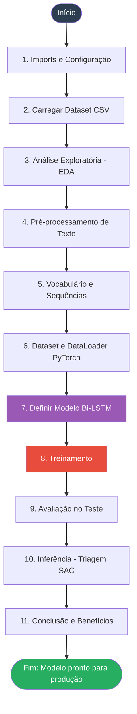

---

## 2. Detalhamento — Configuração e Carga de Dados

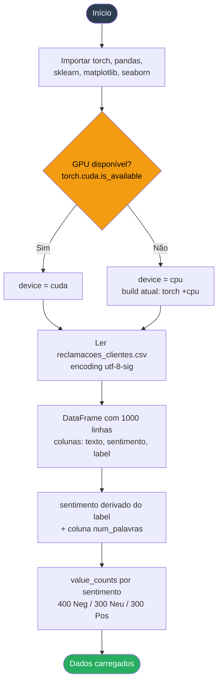

---

## 3. Detalhamento — EDA (Análise Exploratória)

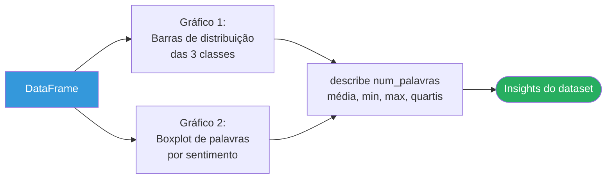

---

## 4. Detalhamento — Pré-processamento de Texto

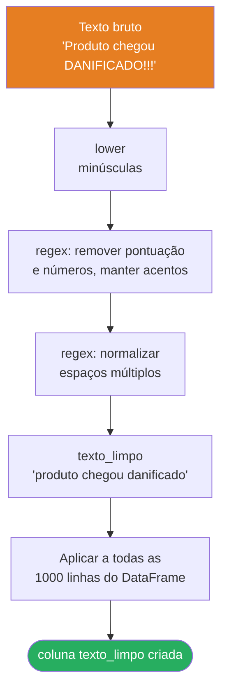

---

## 5. Detalhamento — Vocabulário e Tokenização

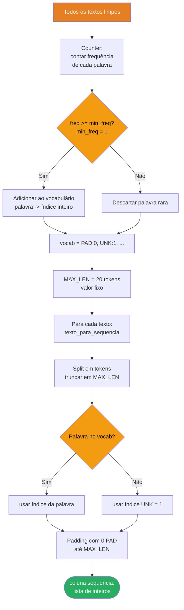

---

## 6. Detalhamento — Dataset e DataLoader

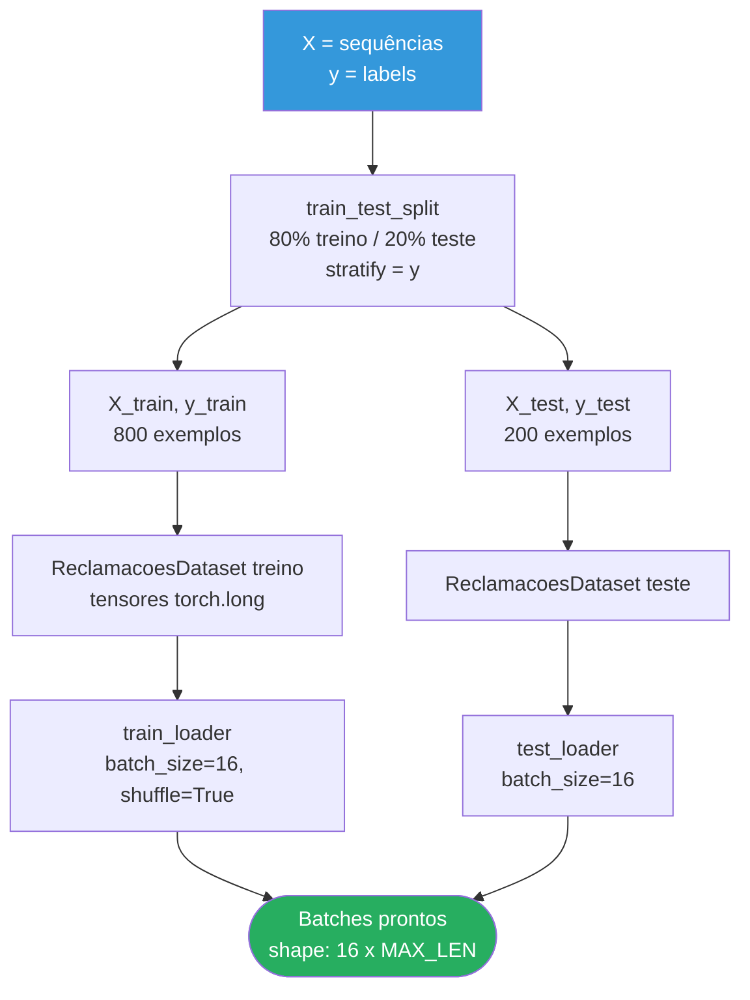

---

## 7. Detalhamento — Arquitetura do Modelo Bi-LSTM

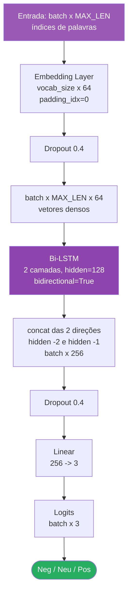

---

## 8. Detalhamento — Loop de Treinamento

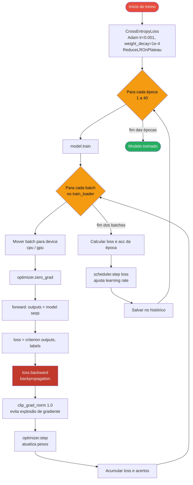

---

## 9. Detalhamento — Avaliação

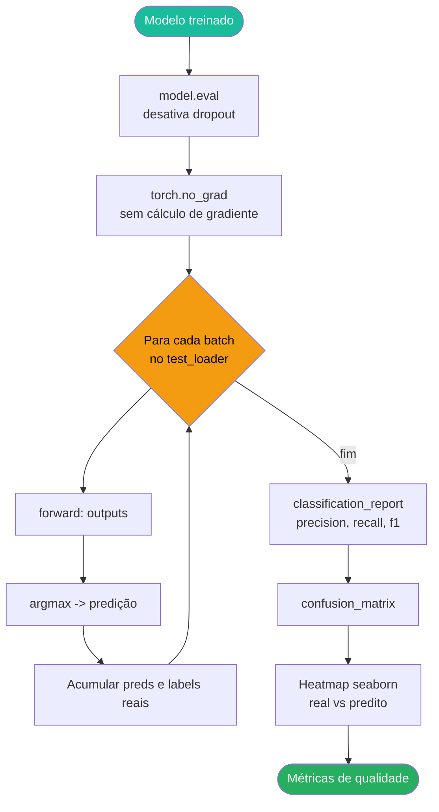

---

## 10. Detalhamento — Inferência (Triagem SAC)

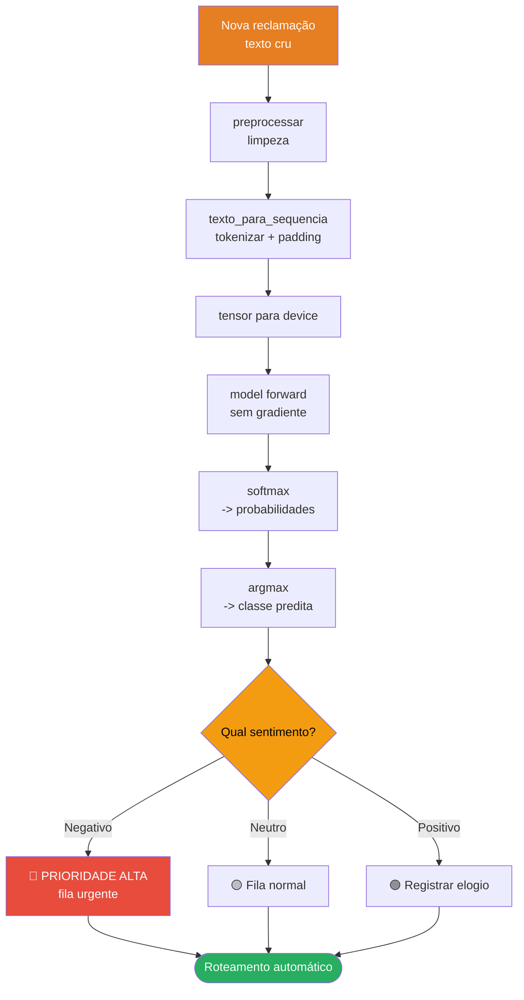

---

## 11. Conclusão e Benefícios Corporativos

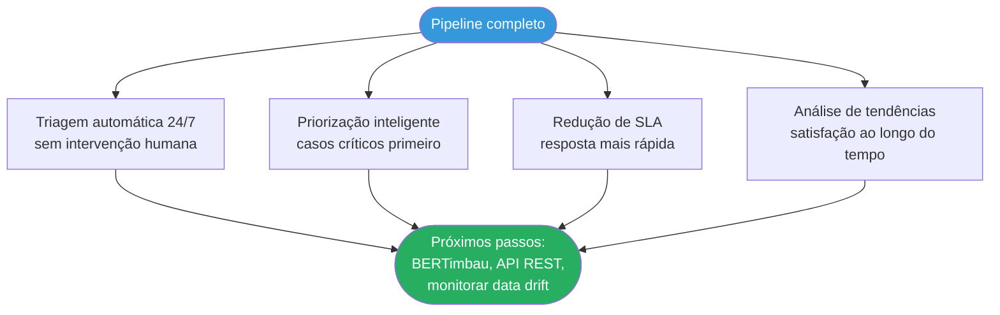

---

## 12. Fluxo de Dados End-to-End (resumo visual)

