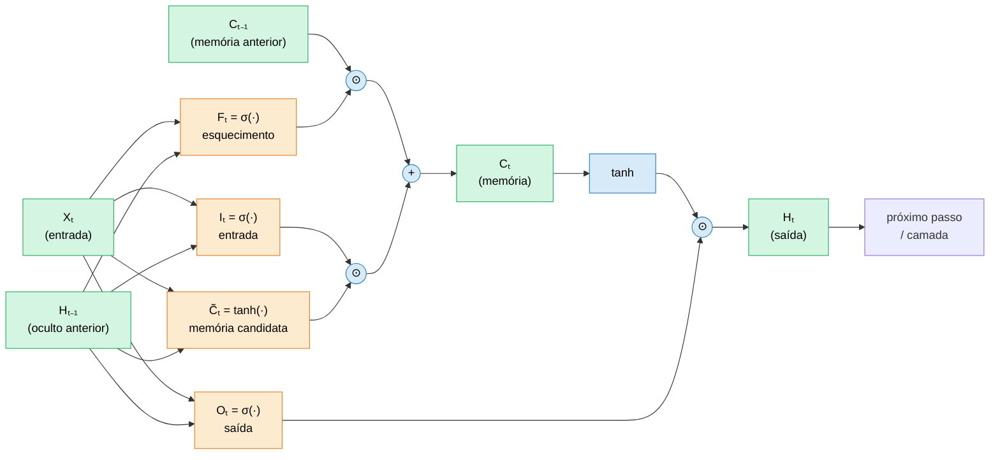

# Como funciona uma rede LSTM (Long Short-Term Memory)

> Explicação baseada em [Dive into Deep Learning — capítulo LSTM](https://www.d2l.ai/chapter_recurrent-modern/lstm.html),
> conectada ao uso prático no notebook [analise_sentimentos_SAC.ipynb](analise_sentimentos_SAC.ipynb)
> (classificação de sentimentos de reclamações de SAC com uma Bi-LSTM).

---

## 1. O problema que a LSTM resolve

Redes recorrentes simples (RNNs) processam uma sequência (por exemplo, as palavras de uma frase)
um passo de tempo por vez, carregando um **estado oculto** `H` que resume o que já foi lido.

Em teoria isso permitiria capturar dependências de longo alcance, como em:

> *"o produto **não** é bom"* vs *"o produto é **muito** bom"*

onde a palavra "não", lá no começo, muda completamente o sentido do final da frase.

Na prática, a RNN simples falha nisso por causa dos **gradientes que desaparecem ou explodem**
(*vanishing / exploding gradients*). Ao propagar o erro para trás por muitos passos de tempo,
o gradiente é multiplicado repetidamente: ele encolhe até ~0 (a rede "esquece" o início da
sequência) ou cresce sem controle (treino instável).

A **LSTM** foi criada exatamente para isso: ela mantém uma **célula de memória** (`C`) com um
caminho "quase direto" no tempo, controlado por **portões (gates)** que decidem o que guardar,
o que esquecer e o que expor. Esse caminho com auto-conexão de peso ≈ 1 deixa o gradiente fluir
por muitos passos sem desaparecer.

---

## 2. Os dois estados que a LSTM carrega

A cada passo de tempo `t`, a LSTM mantém **dois** vetores (diferente da RNN simples, que tem só um):

| Símbolo | Nome | Papel |
|---|---|---|
| `C_t` | **Célula de memória** (*cell state*) | Memória de longo prazo; "esteira transportadora" da informação |
| `H_t` | **Estado oculto** (*hidden state*) | Saída do passo `t`; o que é exposto para a próxima camada/passo |

A entrada do passo é `X_t` (no nosso notebook, o **embedding** da palavra atual).

---

## 3. Os três portões (gates)

Cada portão é uma pequena camada linear seguida de uma **sigmoide (σ)**, que comprime os valores
para o intervalo `(0, 1)`. Pense em cada valor como uma "válvula": **0 = fecha tudo**, **1 = deixa passar tudo**.

**Portão de entrada** — quanto da nova informação candidata entra na memória:

$$\mathbf{I}_t = \sigma\!\left(\mathbf{X}_t \mathbf{W}_{xi} + \mathbf{H}_{t-1} \mathbf{W}_{hi} + \mathbf{b}_i\right)$$

**Portão de esquecimento** — quanto da memória anterior é mantido:

$$\mathbf{F}_t = \sigma\!\left(\mathbf{X}_t \mathbf{W}_{xf} + \mathbf{H}_{t-1} \mathbf{W}_{hf} + \mathbf{b}_f\right)$$

**Portão de saída** — quanto da memória é exposto no estado oculto:

$$\mathbf{O}_t = \sigma\!\left(\mathbf{X}_t \mathbf{W}_{xo} + \mathbf{H}_{t-1} \mathbf{W}_{ho} + \mathbf{b}_o\right)$$

Todos os três olham para a **mesma informação** (`X_t` e o estado oculto anterior `H_{t-1}`),
mas aprendem pesos `W` e vieses `b` diferentes, e por isso tomam decisões diferentes.

---

## 4. O nó de entrada (memória candidata)

Em paralelo aos portões, a LSTM calcula uma **memória candidata** `C̃_t` — a "proposta" de
informação nova a ser adicionada. Aqui a ativação é **tanh**, que produz valores em `(-1, 1)`
(permite tanto reforçar quanto inibir):

$$\tilde{\mathbf{C}}_t = \tanh\!\left(\mathbf{X}_t \mathbf{W}_{xc} + \mathbf{H}_{t-1} \mathbf{W}_{hc} + \mathbf{b}_c\right)$$

---

## 5. Atualização da célula de memória (o coração da LSTM)

Aqui acontece a mágica. A nova memória combina **o que esquecer do passado** com
**o que aprender de novo**, usando produto **elemento a elemento** (`⊙`, produto de Hadamard):

$$\mathbf{C}_t = \underbrace{\mathbf{F}_t \odot \mathbf{C}_{t-1}}_{\text{mantém parte da memória antiga}} + \underbrace{\mathbf{I}_t \odot \tilde{\mathbf{C}}_t}_{\text{adiciona parte da informação nova}}$$

- Se `F_t ≈ 1` e `I_t ≈ 0` → a memória é **preservada** intacta (ótimo para guardar contexto longo, como aquele "não").
- Se `F_t ≈ 0` e `I_t ≈ 1` → a memória antiga é **descartada** e substituída pela nova.
- Valores intermediários permitem **misturar** suavemente o antigo com o novo.

Esse caminho aditivo (soma, em vez de multiplicação repetida) é o que evita o
desaparecimento do gradiente.

---

## 6. Cálculo do estado oculto (a saída)

Finalmente, o estado oculto é uma **versão filtrada** da memória, controlada pelo portão de saída:

$$\mathbf{H}_t = \mathbf{O}_t \odot \tanh(\mathbf{C}_t)$$

O $\tanh(\mathbf{C}_t)$ reescala a memória para `(-1, 1)`, e `O_t` decide **quanto** dela vira saída.
Isso permite a rede **acumular memória silenciosamente** (guardar em `C_t` sem expor em `H_t`)
e só "liberar" a informação quando for relevante.

---

## 7. Fluxo completo de um passo de tempo



Resumo das equações:

$$
\begin{aligned}
\mathbf{I}_t        &= \sigma\!\left(\mathbf{X}_t \mathbf{W}_{xi} + \mathbf{H}_{t-1} \mathbf{W}_{hi} + \mathbf{b}_i\right) && \text{(portão de entrada)} \\
\mathbf{F}_t        &= \sigma\!\left(\mathbf{X}_t \mathbf{W}_{xf} + \mathbf{H}_{t-1} \mathbf{W}_{hf} + \mathbf{b}_f\right) && \text{(portão de esquecimento)} \\
\mathbf{O}_t        &= \sigma\!\left(\mathbf{X}_t \mathbf{W}_{xo} + \mathbf{H}_{t-1} \mathbf{W}_{ho} + \mathbf{b}_o\right) && \text{(portão de saída)} \\
\tilde{\mathbf{C}}_t &= \tanh\!\left(\mathbf{X}_t \mathbf{W}_{xc} + \mathbf{H}_{t-1} \mathbf{W}_{hc} + \mathbf{b}_c\right) && \text{(memória candidata)} \\
\mathbf{C}_t        &= \mathbf{F}_t \odot \mathbf{C}_{t-1} + \mathbf{I}_t \odot \tilde{\mathbf{C}}_t && \text{(atualização da memória)} \\
\mathbf{H}_t        &= \mathbf{O}_t \odot \tanh(\mathbf{C}_t) && \text{(estado oculto / saída)}
\end{aligned}
$$

---

## 8. Dimensões dos tensores

Para um lote (*batch*) de tamanho `n`, dimensão de entrada `d` e `h` unidades ocultas:

| Tensor | Forma | Significado |
|---|---|---|
| $\mathbf{X}_t$ | $n \times d$ | entrada do passo (embeddings) |
| $\mathbf{I}_t, \mathbf{F}_t, \mathbf{O}_t, \tilde{\mathbf{C}}_t$ | $n \times h$ | portões e memória candidata |
| $\mathbf{C}_t, \mathbf{H}_t$ | $n \times h$ | memória e estado oculto |
| $\mathbf{W}_{x\ast}$ | $d \times h$ | pesos entrada → oculto |
| $\mathbf{W}_{h\ast}$ | $h \times h$ | pesos oculto → oculto |
| $\mathbf{b}_{\ast}$ | $1 \times h$ | vieses |

---

## 9. LSTM Bidirecional (a que usamos no notebook)

No notebook a LSTM é **bidirecional** (`bidirectional=True`):
duas LSTMs leem a frase ao mesmo tempo —
uma da **esquerda → direita** e outra da **direita → esquerda** — e suas saídas são concatenadas.

Por que isso ajuda em análise de sentimento? Porque o sentido de uma palavra depende
do contexto **dos dois lados**. Ler "não" e só depois "bom" é diferente de já saber que
existe um "bom" mais à frente quando se lê "não". Por isso o classificador final recebe
`hidden_dim × 2` features (no notebook, `128 × 2 = 256`).

Trecho correspondente do notebook:

```python
self.lstm = nn.LSTM(
    input_size=embed_dim,
    hidden_size=hidden_dim,
    num_layers=num_layers,
    batch_first=True,
    dropout=dropout,
    bidirectional=True,      # lê esquerda→direita E direita→esquerda
)
self.fc = nn.Linear(hidden_dim * 2, num_classes)  # *2 por ser bidirecional
```

O PyTorch implementa **todas** as equações das seções 3–6 internamente dentro de `nn.LSTM` —
não precisamos programar os portões à mão. Passamos apenas a sequência de embeddings e
recebemos os estados ocultos; pegamos o último estado de cada direção, concatenamos e
ligamos a uma camada linear que produz as 3 classes (Negativo / Neutro / Positivo).

---

## 10. Pontos-chave para fixar

1. **Dois estados:** memória $\mathbf{C}$ (longo prazo) + estado oculto $\mathbf{H}$ (saída do passo).
2. **Três portões sigmoides** ($\mathbf{I}$, $\mathbf{F}$, $\mathbf{O}$): válvulas entre 0 e 1.
3. **Memória candidata $\tilde{\mathbf{C}}$** com $\tanh$: a proposta de informação nova.
4. **Atualização aditiva** $\mathbf{C}_t = \mathbf{F}_t \odot \mathbf{C}_{t-1} + \mathbf{I}_t \odot \tilde{\mathbf{C}}_t$: o segredo contra o gradiente que desaparece.
5. **Saída filtrada** $\mathbf{H}_t = \mathbf{O}_t \odot \tanh(\mathbf{C}_t)$: a rede escolhe o que expor.
6. **Bidirecional** lê o contexto dos dois lados — essencial para entender negações em sentimento.

---

## Referências

- Zhang, Lipton, Li, Smola. *Dive into Deep Learning* — [Long Short-Term Memory (LSTM)](https://www.d2l.ai/chapter_recurrent-modern/lstm.html)
- Hochreiter & Schmidhuber (1997), *Long Short-Term Memory*, Neural Computation.
- Documentação PyTorch: [`torch.nn.LSTM`](https://pytorch.org/docs/stable/generated/torch.nn.LSTM.html)
