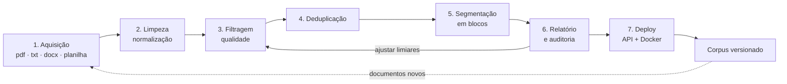

# Aula — PLN na prática: aquisição e filtragem de textos, do arquivo ao corpus

**Disciplina:** ARTIFICIAL INTELLIGENCE e DEEP LEARNING APPLICADA
**Professor:** Dr. Alexandre Miguel de Carvalho
**Ferramentas:** Python 3.12 · pypdf · python-docx · openpyxl · FastAPI

---

## 1. Por que esta aula existe

Na aula de CNN, os dados chegaram prontos: uma linha de `torchvision` baixou
70.000 imagens já rotuladas, no mesmo tamanho, no mesmo formato. Foi uma
simplificação honesta para ensinar arquitetura de rede — e é uma mentira sobre
como projetos reais começam.

Em processamento de linguagem natural não existe esse conforto. Os dados chegam
como **arquivos**: um PDF que é foto de uma folha, uma planilha em que o texto
está espremido entre colunas numéricas, um `.txt` de 2011 codificado em cp1252,
um `.docx` cujo conteúdo importante está dentro de uma tabela. Antes de existir
qualquer modelo, alguém precisa transformar essa bagunça em um corpus.

Essa etapa costuma consumir **a maior parte do tempo do projeto**, quase nunca
aparece nos tutoriais, e é onde os erros mais caros acontecem — porque são
erros silenciosos: nada quebra, nenhuma exceção é levantada, e o corpus sai
plausível e errado.



### O problema escolhido

**Montar o corpus da base de conhecimento de uma empresa industrial** a partir
de um acervo heterogêneo: relatórios técnicos em PDF, manuais em DOCX,
avaliações de clientes em planilha, chamados em CSV e comunicados em TXT.

O acervo de exemplo é gerado por `src/make_samples.py` e contém, **de
propósito**, todas as patologias que o pipeline precisa saber tratar:

| Documento | Patologia embutida |
|---|---|
| `relatorio_tecnico.pdf` | Cabeçalho e rodapé repetidos, hifenização de fim de linha |
| `nota_fiscal_escaneada.pdf` | **Sem camada de texto** — extração devolve `""` sem erro |
| `comunicado_legado.txt` | Codificado em cp1252, não em UTF-8 |
| `noticia_copia.txt` | Duplicata **exata** |
| `noticia_editada.txt` | **Quase**-duplicata (similaridade 0,783) |
| `procedimento_operacional.docx` | Conteúdo dentro de uma **tabela** |
| `avaliacoes_clientes.xlsx` | Uma aba textual e uma puramente numérica |
| `chamados.csv` | Separador `;` e codificação cp1252 |
| `ocr_ruim.txt` | Ruído de OCR (`R3l4t0ri0 d3 \|nsp3ç4o`) |
| `abstract.txt` | Inglês — idioma fora do alvo |
| `menu_site.txt` | Navegação de site, sem conteúdo |
| `leia-me.txt` | Curto demais |

Por que um acervo sintético e não documentos reais: porque assim **você sabe a
resposta certa**. Quando o pipeline descarta 5 dos 27 trechos, é possível
verificar, um por um, se descartou os certos. Com documentos reais você só teria
um número, e nenhuma forma de saber se ele está bom.

---

## 2. Objetivos de aprendizagem

Ao final da aula, o estudante deve ser capaz de:

1. **Explicar** a patologia característica de cada formato (codificação no TXT,
   ausência de estrutura no PDF, conteúdo em tabela no DOCX, texto em célula na
   planilha) e escolher a estratégia de extração adequada.
2. **Implementar** leitores que preservam a **procedência** de cada trecho
   (arquivo, página, aba, linha) e justificar por que isso é obrigatório.
3. **Distinguir** normalização (torna igual o que deveria ser igual) de
   destruição de informação, e defender por que um pipeline moderno é
   conservador.
4. **Aplicar** heurísticas de qualidade quantitativas e **calibrar** seus
   limiares olhando a distribuição das métricas, não por intuição.
5. **Detectar** duplicatas exatas com hash e quase-duplicatas com MinHash + LSH,
   explicando por que a primeira técnica não substitui a segunda.
6. **Auditar** um corpus: ler os descartes, medir o aproveitamento e produzir a
   ficha técnica (*datasheet*) do conjunto resultante.
7. **Publicar** o pipeline como serviço HTTP e garantir, com teste automatizado,
   que o serviço e o processamento em lote produzem o mesmo texto.

---

## 3. Preparação do ambiente

```bash
conda activate p_312          # ambiente já existente nesta máquina
cd caminho/para/nlp1
pip install -r requirements.txt
```

Verificação rápida:

```bash
python -c "import pypdf, docx, openpyxl; print(pypdf.__version__, openpyxl.__version__)"
# 6.16.2 3.1.5
```

> **Windows — e este é o primeiro caso real da aula.** No Windows, o Python
> escolhe a codificação da saída padrão pelo **locale** do sistema (em geral
> cp1252), e **não** pela página de código do console. Consequência: rodar
> `chcp 65001` antes **não resolve** — o `print` continua tentando codificar em
> cp1252 e derruba o script com `UnicodeEncodeError` no primeiro caractere fora
> dessa tabela.
>
> Por isso todos os scripts chamam `utils.configurar_terminal()` logo no início
> do `__main__`, que reconfigura a saída para UTF-8 de dentro do programa, com
> `errors="replace"` como rede de segurança. **Não é preciso definir nenhuma
> variável de ambiente.**
>
> É o mesmo princípio da cadeia de codificações de `readers.decodificar`:
> tente o certo, degrade com elegância, nunca trave. Um pipeline de dados não
> pode morrer por causa da *formatação de um log*.

### Estrutura do projeto

```
nlp1/
├── README.md              <- esta aula
├── exercicios.md          <- atividades e rubrica de avaliação
├── requirements.txt
├── src/
│   ├── config.py          <- ETAPA 0: limiares e caminhos, em um lugar só
│   ├── utils.py           <- JSONL, hashes, tokenização estatística, gráficos
│   ├── make_samples.py    <- gera o acervo de exemplo (inclui um gerador de PDF)
│   ├── readers.py         <- ETAPA 1: um leitor por formato, com procedência
│   ├── clean.py           <- ETAPA 2: normalização e limpeza
│   ├── filters.py         <- ETAPA 3: métricas de qualidade e decisão
│   ├── dedup.py           <- ETAPA 4: hash exato + MinHash/LSH
│   ├── pipeline.py        <- orquestra 1 a 5 e grava os artefatos
│   └── report.py          <- ETAPA 6: relatório, auditoria e gráficos
├── deploy/
│   ├── api.py             <- ETAPA 7: serviço FastAPI
│   ├── testar_api.py      <- teste de paridade serviço x lote
│   └── Dockerfile
├── data/brutos/           <- acervo de entrada (gerado ou seu)
└── outputs/               <- corpus, descartes, relatórios e gráficos
```

---

## 4. Fundamentos: o mínimo de teoria necessário

### 4.1 A anatomia de cada formato

Não existe "ler um arquivo de texto". Existe ler **cada formato**, e cada um
falha de um jeito diferente.

| Formato | O que ele guarda | Como ele falha |
|---|---|---|
| **TXT** | Bytes. Só isso. | O arquivo **não diz** qual é a sua codificação. Ler cp1252 como UTF-8 gera exceção ou `informação` |
| **PDF** | Posições de glifos numa página | Não tem parágrafo, não tem ordem de leitura, não tem linha. Tudo isso é **reconstruído por heurística** pelo extrator |
| **DOCX** | ZIP de XML | O conteúdo está em parágrafos **e em tabelas**; quem itera só `documento.paragraphs` perde as tabelas em silêncio |
| **Planilha** | Células tipadas em abas | O texto não flui: está misturado com números, datas e fórmulas. É preciso **decidir** quais colunas são texto |

#### O PDF merece um parágrafo próprio

Um PDF não contém "o texto do documento". Ele contém instruções do tipo
*"desenhe o glifo 'A' na coordenada (72, 806) com a fonte Helvetica 11"*. Abra
`src/make_samples.py` e veja o gerador de PDF escrito à mão: o fluxo de conteúdo
de uma página é literalmente uma sequência de comandos de posicionamento.

Disso decorre tudo o que dá errado:

- **quebras de linha no meio da frase** — a linha acabou porque a margem chegou;
- **hifenização** — `trimes-` na linha 5 e `tre` na linha 6 são a mesma palavra;
- **cabeçalho e rodapé** — repetidos em toda página, misturados ao conteúdo;
- **colunas intercaladas** — o extrator lê da esquerda para a direita e embaralha;
- **página escaneada** — se não há camada de texto, o resultado é `""`, **sem erro**.

Esse último é o mais perigoso do pipeline inteiro. Um acervo com 30% de PDFs
escaneados processa sem nenhuma mensagem, e o corpus sai com 30% do conteúdo
faltando. A única defesa é **medir**: por isso `readers.ler_pdf` emite um trecho
vazio em vez de descartar a página, e por isso o relatório destaca o motivo
`vazio` separadamente dos demais.

### 4.2 Limpar não é "tirar o que é feio"

Normalizar é **tornar equivalentes as coisas que deveriam ser iguais**. A
palavra "inspeção" precisa ser o mesmo símbolo, tenha ela vindo de um PDF com
acento pré-composto (`ç` = U+00E7) ou de um DOCX com acento combinante
(`c` + U+0327). Visualmente idênticas, bytes diferentes, tokens diferentes.

Mas cada regra de limpeza **apaga informação**, e informação apagada não volta:

| Operação | O que ela destrói |
|---|---|
| minúsculas | a distinção entre "Apple" (empresa) e "apple" (fruta) |
| remover acento | "e", "é", "ê" viram a mesma coisa |
| remover pontuação | o limite da frase |
| remover stopwords | a negação, as relações, a sintaxe |

> **Este conselho mudou nos últimos anos e vale entender por quê.** Com modelos
> de saco de palavras (TF-IDF, Naive Bayes), reduzir o vocabulário era essencial
> e a receita "minúscula + sem acento + sem stopword + stemming" fazia sentido.
> Com modelos baseados em transformadores, o tokenizador já lida com maiúsculas
> e morfologia — e essa limpeza agressiva só joga sinal fora.
>
> Por isso o pipeline desta aula **normaliza forma e não toca no conteúdo**:
> corrige defeito de extração, não "simplifica" a língua.

Há ainda uma limpeza que **exige olhar o arquivo inteiro**, e não o trecho:
nenhuma regra fixa sabe que `ACME Tecnologia - Relatorio Interno RT-2024-017` é
cabeçalho. Mas há uma pista estatística universal: **cabeçalho é a linha que
aparece em toda página**. É assim que `clean.detectar_cabecalhos_rodapes`
funciona — e é o motivo de o pipeline processar arquivo por arquivo.

### 4.3 Limpeza *ou* filtragem? A distinção que organiza o pipeline

Duas perguntas parecidas com respostas opostas:

- `Página 1 de 3` no rodapé de um relatório → **lixo local**. Some a linha, o
  documento continua ótimo. Isso se resolve **removendo a linha, na limpeza**.
- Um arquivo que é só `Início · Contato · Aceitar cookies · Leia mais` → o
  documento **é** moldura. Isso se resolve **descartando o documento, na
  filtragem**.

> **A limpeza remove a moldura; a filtragem descarta o que é só moldura.**

Confundir os dois papéis produz um pipeline que joga fora justamente os
documentos bem formatados — porque eles são os que têm rodapé. Veja
`PADROES_MOLDURA` e `PADROES_BOILERPLATE` em [src/config.py](src/config.py).

### 4.4 As heurísticas de qualidade

Todas medem a mesma coisa por ângulos diferentes: **isto parece prosa escrita
por uma pessoa, ou parece resíduo de extração?** São as mesmas usadas na
construção do C4, do Gopher e do RefinedWeb.

| Métrica | Reprova quando | Sintoma que ela pega |
|---|---|---|
| nº de caracteres/palavras | abaixo do mínimo | fragmento sem contexto |
| proporção de símbolos | alta | OCR ruim, marcação vazada |
| proporção de dígitos | alta | tabela, extrato, log |
| proporção alfabética | baixa | rede de segurança das duas acima |
| proporção de maiúsculas | alta | BANNER, menu, título solto |
| comprimento médio da palavra | fora de 2,5–12 | `R E L A T Ó R I O` ou palavras coladas |
| proporção de linhas repetidas | alta | formulário, índice, listagem |
| proporção de boilerplate | alta | navegação, aviso de cookie |
| proporção de stopwords PT | baixa | outro idioma, código, listagem |

O detector de idioma merece nota: é o **detector do pobre**. Todo texto em
português tem 20% a 40% de "de, a, o, que, e, do, da"; um texto em inglês fica
perto de 4%. No acervo desta aula a separação é limpa (0,04 contra 0,16–0,44),
mas ele falha com textos curtos, com espanhol e com português cheio de termos
técnicos em inglês. Em produção, troque por fastText `lid.176`.

### 4.5 MinHash: encontrar cópias sem comparar todos contra todos

Hash exato só pega cópia literal — uma data diferente no rodapé já produz um
hash completamente distinto. Hash é tudo ou nada.

Para quase-duplicatas, o caminho é medir a **similaridade de Jaccard** entre os
conjuntos de *n*-gramas de palavras (*shingles*) dos dois documentos:

$$J(A,B) = \frac{|A \cap B|}{|A \cup B|}$$

Por que *n*-gramas e não palavras soltas? Porque dois textos diferentes sobre o
mesmo assunto compartilham quase todas as **palavras** — ambos falam de
"inspeção", "peça", "lote". Já a sequência exata de 5 palavras só coincide
quando um foi copiado do outro. **O n-grama captura ordem, e é a ordem que
distingue cópia de assunto em comum.**

O problema é o custo: comparar 100 mil documentos dois a dois são 5 bilhões de
comparações. **MinHash** resolve com uma ideia elegante:

> Embaralhe o universo de todos os shingles com uma permutação aleatória e
> anote qual shingle do documento ficou em **primeiro** lugar. A probabilidade
> de dois documentos terem o mesmo primeiro colocado **é exatamente a
> similaridade de Jaccard entre eles**.

Repetindo com *k* permutações, a fração de posições coincidentes estima a
similaridade com erro da ordem de $1/\sqrt{k}$. Um documento de 20.000 shingles
vira 64 inteiros.

**LSH** completa: quebre a assinatura em *b* bandas de *r* posições; dois
documentos viram candidatos se coincidirem inteiramente em pelo menos uma banda.
A probabilidade de um par com similaridade *s* virar candidato é
$1-(1-s^r)^b$ — uma curva em S cujo ponto de virada fica em torno de
$(1/b)^{1/r}$. Com b=16 e r=4, a virada fica perto de 0,4.

Por que deduplicar importa, e muito:

- **desbalanceia o corpus** — um documento repetido 50 vezes tem 50 vezes mais peso;
- **contamina a avaliação** — a mesma página no treino e no teste faz a métrica medir memorização (é o vazamento mais comum em PLN);
- **aumenta a memorização literal** — trechos repetidos são os que os modelos reproduzem palavra por palavra: problema de privacidade e de direito autoral;
- **custa dinheiro** — dez cópias ocupam dez lugares entre os resultados de uma busca.

---

## 5. O pipeline, etapa por etapa

### ETAPA 1 — Aquisição

**Arquivo:** [src/readers.py](src/readers.py) · **Comando:** `python src/readers.py`

```
arquivo                            formato   tamanho  trechos  palavras
-----------------------------------------------------------------------
avaliacoes_clientes.xlsx              xlsx    6.3 KB        6       203
chamados.csv                           csv     884 B        4       120
comunicado_legado.txt                  txt     976 B        1       145
nota_fiscal_escaneada.pdf              pdf     729 B        1         0  (1 vazio(s)!)
procedimento_operacional.docx         docx   36.6 KB        3       217
relatorio_tecnico.pdf                  pdf    4.2 KB        3       399
```

Use `python src/readers.py --texto` para ver o que cada leitor realmente
extraiu. **Sempre inspecione a extração antes de seguir:** um pipeline
alimentado com extração errada não reclama, apenas produz um corpus errado com
aparência perfeita.

Três decisões visíveis no código:

1. **Cada trecho carrega a sua procedência** — arquivo, formato e localizador
   (`página 3`, `aba Avaliacoes · linha 12`, `tabela 1`). Sem isso você não
   consegue auditar o corpus, atender a um pedido de remoção (LGPD), nem citar
   a fonte de uma resposta gerada por um modelo.
2. **A granularidade é a unidade natural do formato** — uma página de PDF, uma
   linha de planilha, uma tabela do DOCX. Isso permite descartar a capa sem
   descartar o relatório.
3. **Falha de leitura não derruba o processo** — `ErroDeLeitura` é capturado e
   registrado. Um acervo real tem arquivos corrompidos e protegidos por senha;
   se um deles matar o processo, você nunca termina a ingestão.

> **O detalhe do DOCX que quase todo mundo erra:** `documento.paragraphs`
> devolve só os parágrafos, `documento.tables` só as tabelas, e nenhum dos dois
> preserva a **ordem** entre eles. Num procedimento onde a cláusula explica a
> tabela logo abaixo, essa ordem é o significado. A solução em
> `_iterar_corpo_docx` desce ao XML e itera os filhos de `<w:body>` na ordem
> real.

### ETAPA 2 — Limpeza

**Arquivo:** [src/clean.py](src/clean.py) · **Comando:** `python src/clean.py data/brutos/relatorio_tecnico.pdf`

```
Linhas de cabeçalho/rodapé detectadas (2):
  - 'ACME Tecnologia - Relatorio Interno RT-2024-017'
  - 'Documento de circulacao restrita - nao distribuir'

ANTES — página 1 (954 caracteres)
ACME Tecnologia  -  Relatorio Interno RT-2024-017
1. Contexto do projeto
A area de inspecao visual da fabrica registrou, no ultimo trimes-
tre, um aumento de 18% no numero de pecas devolvidas pelo cli-
ente final. A analise preliminar indica que a maior parte das fa-
...
Pagina 1 de 3

DEPOIS — página 1 (827 caracteres)
1. Contexto do projeto
A area de inspecao visual da fabrica registrou, no ultimo trimestre, um
aumento de 18% no numero de pecas devolvidas pelo cliente final. A analise...
```

**A ordem das operações não é arbitrária**, e trocá-la quebra o resultado de um
jeito silencioso — o texto sai plausível, só que com o rodapé no meio do
parágrafo:

```
1. mojibake     -> antes de tudo: normalizar bytes errados só os congela
2. unicode NFKC -> forma canônica; desfaz as ligaduras fi/fl do PDF
3. controle     -> some com o invisível (\x0c, U+200B, hífen opcional)
4. pontuação    -> aspas e travessões uniformes
5. moldura      -> AINDA com uma linha por linha do original
6. hifenização  -> PRECISA dos "\n" originais para achar o fim da linha
7. reparágrafos -> idem; por isso vem antes de mexer nos espaços
8. espaços      -> só agora, quando a estrutura de linhas já cumpriu o papel
9. PII          -> por último, sobre o texto já normalizado
```

O passo 7 merece atenção porque envolve um impasse real. Estas duas situações
são indistinguíveis pela primeira linha:

```
A analise preliminar indica que a maior parte das      <- deve juntar
falhas nao e detectada pela conferencia manual.

1. Contexto do projeto                                 <- NÃO deve juntar
A area de inspecao visual da fabrica registrou...
```

Duas evidências resolvem: a linha seguinte **começa em minúscula** (continuação
quase certa), ou a linha anterior está **cheia** — chega perto da maior largura
do bloco, ou seja, acabou porque a margem chegou, não porque a ideia acabou.
Título é curto por natureza; linha diagramada é cheia por natureza.

**Sobre dados pessoais (LGPD):** `--mascarar-pii` substitui e-mail, CPF, CNPJ,
telefone e CEP por marcadores. Isso vive no pipeline, e não "depois", porque o
corpus é copiado, versionado e usado para treinar: **um CPF que entra no treino
pode ser reproduzido pelo modelo, e aí não há como retirá-lo.** Mas note as
limitações no docstring: expressão regular não reconhece nome de pessoa. Isto é
minimização de dados, **não é anonimização**.

### ETAPA 3 — Filtragem

**Arquivo:** [src/filters.py](src/filters.py) · **Comando:** `python src/filters.py`

Este comando é a **ferramenta de calibração** da aula. Ele mostra todas as
métricas de todos os trechos, aprovados e reprovados, lado a lado:

```
documento                                  car.  pal.   alf   dig   sim   MAI |pal|  stop   rep  boil  decisão
--------------------------------------------------------------------------------------------------------------
abstract.txt·arquivo inteiro               1070   160  0.84  0.00  0.00  0.02   5.6  0.04  0.00  0.00  REJ: outro_idioma
chamados.csv·linha 2                        214    34  0.83  0.00  0.00  0.01   5.2  0.41  0.00  0.00  aceito
leia-me.txt·arquivo inteiro                  63     9  0.84  0.00  0.00  0.04   5.9  0.22  0.00  0.00  REJ: curto_demais
menu_site.txt·arquivo inteiro               256    35  0.79  0.05  0.00  0.10   5.7  0.26  0.00  1.00  REJ: boilerplate
nota_fiscal_escaneada.pdf·página 1            0     0  0.00  0.00  0.00  0.00   0.0  0.00  0.00  0.00  REJ: vazio (+4)
ocr_ruim.txt·arquivo inteiro                419   112  0.35  0.26  0.14  0.12   1.3  0.08  0.00  0.00  REJ: ruido_simbolos (+2)
relatorio_tecnico.pdf·página 1              827   126  0.81  0.01  0.00  0.01   5.3  0.36  0.00  0.00  aceito
```

**Como se lê essa tabela:** olhe a coluna de uma métrica nos aprovados e nos
reprovados. Se os dois grupos se sobrepõem, o limiar está no lugar errado — ou a
métrica não separa o que você quer. Aqui `stop` vale 0,04 no inglês e 0,16–0,44
no português: separação limpa, limiar seguro em 0,06.

Três princípios de projeto desta etapa:

1. **Nenhum descarte silencioso.** Todo rejeitado vai para `rejeitados.jsonl`
   com o motivo e as métricas. Um filtro que você não consegue auditar é um bug
   que você não consegue ver.
2. **Um motivo principal, todos registrados.** Documento ruim costuma ser ruim
   de várias maneiras: o PDF escaneado reprova em `vazio` *e* em mais quatro.
3. **Limiar é hipótese, não verdade.** Os valores em `config.py` foram
   calibrados olhando esta tabela — e o comentário no arquivo diz exatamente
   por quê.

> **Uma calibração real, documentada no código:** o valor "natural" de
> `min_palavras` para páginas de PDF seria 40. Mas uma **linha de planilha** tem
> entre 29 e 38 palavras — e 40 apagaria as duas fontes tabulares inteiras, sem
> aviso. O limiar ficou em 25. Suba para 40 e rode de novo para ver o estrago:
> é o exercício 2.2.

### ETAPA 4 — Deduplicação

**Arquivo:** [src/dedup.py](src/dedup.py) · **Comando:** `python src/dedup.py`

```
[duplicata_exata] similaridade 1.000
   cópia   : data/brutos/noticia_copia.txt · arquivo inteiro
   original: data/brutos/noticia.txt · arquivo inteiro

[quase_duplicata] similaridade 0.783
   cópia   : data/brutos/noticia_editada.txt · arquivo inteiro
   original: data/brutos/noticia.txt · arquivo inteiro

Similaridade de Jaccard exata entre as versões da notícia:
                               noticia.txt   noticia_copia.txt  noticia_editada.tx
noticia.txt                          1.000               1.000               0.783
noticia_editada.txt                  0.783               0.783               1.000
```

A matriz mostra a lição: `noticia_copia.txt` cai no hash exato; **`noticia_editada.txt`
só cai no MinHash.** Trocamos um título, uma cidade e a expressão "oito semanas"
por "dois meses" — e o hash já não serve para nada.

E mostra também a fragilidade: **0,783 está a 0,017 do limiar**. Com o padrão da
literatura em 0,80 essa duplicata sobrevive; com 0,75 ela é capturada. Rode
`python src/dedup.py --limiar 0.85` e veja. Não existe valor "certo" — existe
valor **medido e documentado**.

Duas decisões que precisam ser explícitas:

- **Qual cópia sobrevive?** A primeira que aparece — e como os arquivos são
  ordenados por nome, isso é determinístico. Em produção você talvez prefira a
  mais longa ou a mais recente; o importante é que o critério seja uma escolha,
  não um efeito colateral da ordem do sistema de arquivos.
- **Transitividade.** Se A é parecido com B, e B com C, mas A não com C, o
  resultado depende da ordem de chegada. Deduplicação por vizinhança é
  intrinsecamente aproximada.

### ETAPA 5 — Segmentação e o pipeline completo

**Arquivo:** [src/pipeline.py](src/pipeline.py) · **Comando:** `python src/pipeline.py`

```
  1-2. Extraídos e limpos         27 trechos de 14 arquivos
  3.   Rejeitados na filtragem     5
  4.   Removidos por duplicata     2
  5.   Corpus final               20 documentos, 1.553 palavras
       Segmentado em              23 blocos

  Aproveitamento: 74.1% dos trechos extraídos   (0.4s)

  Motivos de descarte:
       1  outro_idioma       Não parece português
       1  curto_demais       Curto demais
       1  boilerplate        Boilerplate/navegação
       1  vazio              Sem texto extraível (PDF escaneado?)
       1  ruido_simbolos     Ruído de símbolos (OCR?)
       1  duplicata_exata    Duplicata exata
       1  quase_duplicata    Quase-duplicata

  [!] 1 trecho(s) sem texto extraível. Provável PDF
      escaneado: o arquivo tem imagem da página, não texto.
      A solução é OCR (ocrmypdf/tesseract), não ajustar filtro.
```

O pipeline grava **seis artefatos**, e não um só:

| Arquivo | Conteúdo |
|---|---|
| `corpus.jsonl` | o que passou |
| `rejeitados.jsonl` | o que não passou, **com o motivo e as métricas** |
| `duplicatas.jsonl` | o que foi removido por repetição, com o original |
| `blocos.jsonl` | o corpus segmentado |
| `relatorio.json` | números agregados de todas as etapas |
| `metadados_corpus.json` | a ficha técnica (*datasheet*) do corpus |

**Gravar os descartes é a decisão de projeto mais importante do arquivo.** Um
pipeline que só produz o corpus final é uma caixa preta: quando alguém perguntar
"cadê o contrato da Souza Ltda.?", a única resposta possível será dar de ombros.
Com `rejeitados.jsonl`, a resposta é *"foi descartado na filtragem por
`curto_demais`, tinha 31 caracteres, aqui está o texto"*.

Sobre o **JSONL** (uma linha JSON por documento): permite processar um corpus de
10 GB linha a linha sem carregar tudo na memória, `head -1` já mostra um
documento inteiro, e a corrupção no meio não invalida o começo. É o formato de
fato para corpora — C4, OSCAR e The Pile são distribuídos assim.

Sobre a **segmentação**: cortar em tamanho fixo parte frases no meio. Cortamos na
fronteira de parágrafo, com **sobreposição** — se a resposta a uma pergunta
estiver bem na emenda entre dois blocos, sem sobreposição ela fica partida e
nenhum bloco responde. O preço é ~15% de texto repetido.

### ETAPA 6 — Relatório e auditoria

**Arquivo:** [src/report.py](src/report.py) · **Comando:** `python src/report.py`

O `pipeline.py` já dá os totais. Este script existe para a pergunta seguinte,
que é a que importa: **o que eu joguei fora, e eu deveria ter jogado?**

```
O FUNIL — quanto sobrou de cada etapa
  1-2. Trechos extraídos e limpos      27  ######################################## 100%
  3.   Sobreviveram à filtragem        22  ################################ 81%
  4.   Sobreviveram à deduplicação     20  ############################# 74%

AUDITORIA — amostra do que foi descartado
-- outro_idioma (1 documento(s)) — Não parece português
   data/brutos/abstract.txt · arquivo inteiro
   1070 car., 160 pal., alf=0.84 sim=0.00 stop=0.04 boil=0.00
   > Automated Visual Inspection in Discrete Manufacturing: A Case Study…

-- vazio (1 documento(s)) — Sem texto extraível (PDF escaneado?)
   data/brutos/nota_fiscal_escaneada.pdf · página 1
   também reprovou em: curto_demais, pouca_letra, palavra_curta, outro_idioma
   > [VAZIO]
```

A saída principal **não é um gráfico, é uma amostra de texto dos descartes**.

> **Regra prática da disciplina:** leia dez rejeitados de cada motivo, na mão,
> antes de considerar um pipeline pronto. Se concordar com os dez, o limiar está
> bom. Se discordar de dois, o limiar está errado — e você descobriu isso pelo
> preço de cinco minutos de leitura, em vez de descobrir depois de treinar um
> modelo por três dias.

Note também o aviso automático: **aproveitamento acima de 95% merece tanta
desconfiança quanto abaixo de 30%.** Filtro que nunca reprova nada normalmente
está desligado por um limiar frouxo, não porque o acervo é impecável.

Três gráficos, três perguntas: `motivos_rejeicao.png` (o que mais derruba
documento?), `distribuicao_tamanhos.png` (meu limiar está na cauda ou no meio da
distribuição?) e `documentos_por_formato.png` (de onde veio o corpus?).

### ETAPA 7 — Deploy

```bash
pip install fastapi "uvicorn[standard]" python-multipart
python -m uvicorn deploy.api:app --reload --port 8000
```

- <http://127.0.0.1:8000> — formulário de teste (envia arquivo ou cola texto)
- <http://127.0.0.1:8000/docs> — documentação interativa (Swagger)
- `GET /saude` — *health check*, devolve os **limiares em uso**
- `POST /extrair` — arquivo → trechos limpos, com a decisão de cada um
- `POST /avaliar` — texto puro → métricas de qualidade + decisão

#### Uma decisão que contraria a aula de CNN — e por quê

Na aula de CNN, o serviço **não importava nada de `src/`**: dependia só do
modelo serializado, e o pré-processamento era reimplementado no servidor.
Aqui fazemos o **oposto** — `deploy/api.py` importa `readers`, `clean` e
`filters` diretamente.

Isso não é incoerência. A regra verdadeira nunca foi "não importe do `src`":

> **Nunca deixe duas cópias da mesma decisão existirem separadas.**

Na CNN, o artefato que atravessa a fronteira é o modelo TorchScript, que carrega
pesos **e** arquitetura — o servidor não precisa do código. Num pipeline de
texto **não existe artefato equivalente**: as regras de limpeza e os limiares
*são* o produto. Se reimplementássemos `limpar()` no servidor, teríamos duas
versões da hifenização, elas divergiriam na primeira correção de bug, e o texto
servido pela API deixaria de ser igual ao do corpus — sem nenhum erro aparecer.
É o mesmo desastre da divergência de pré-processamento da aula de CNN, pela via
oposta.

#### O teste que prova isso

```bash
python deploy/testar_api.py          # com o servidor rodando em outro terminal
```

```
saúde: ok | formatos: .csv, .docx, .md, .pdf, .txt, .xlsm, .xlsx
limiares do serviço: min_palavras=25, min_caracteres=150

arquivo                            trechos   ok  rej      ms  paridade
----------------------------------------------------------------------------
avaliacoes_clientes.xlsx                 6    6    0    17.0  OK
procedimento_operacional.docx            3    3    0    23.0  OK
relatorio_tecnico.pdf                    3    3    0    22.0  OK

Trechos comparados com o corpus em lote: 20
[OK] Texto idêntico ao do modo em lote em todos os trechos aceitos.
Latência média: 8.2 ms por arquivo

/avaliar com mascaramento de PII:
   Contato: [EMAIL], CPF [CPF], tel [TELEFONE].
```

Na aula de CNN o teste comparava a *acurácia*. Aqui a comparação é mais
exigente: exigimos **igualdade exata** do texto, trecho a trecho, entre o
serviço e o lote. Se passar, os dois são o mesmo pipeline. Se falhar, alguém
duplicou uma regra.

#### Empacotar em contêiner

```bash
docker build -t nlp-aquisicao -f deploy/Dockerfile .
docker run -p 8000:8000 nlp-aquisicao
```

Repare no que entra na imagem: `src/` **entra** (as regras são o produto) e
`data/`/`outputs/` ficam de fora (são dados). É o inverso da imagem da CNN — e
pelo mesmo raciocínio.

---

## 6. Roteiro de execução completo

```bash
conda activate p_312
cd nlp1
pip install -r requirements.txt

python src/make_samples.py                          #      gera o acervo de exemplo
python src/readers.py --texto                       # 1.   o que cada leitor extraiu
python src/clean.py data/brutos/relatorio_tecnico.pdf  # 2. antes x depois da limpeza
python src/filters.py                               # 3.   tabela de calibração
python src/dedup.py                                 # 4.   duplicatas e similaridade
python src/pipeline.py                              # 1-5. pipeline completo
python src/report.py                                # 6.   auditoria e gráficos
python -m uvicorn deploy.api:app --port 8000        # 7.   servidor
python deploy/testar_api.py                         #      (em outro terminal)
```

Para usar com **os seus próprios documentos**:

```bash
python src/pipeline.py --entrada /caminho/para/seus_documentos --mascarar-pii
python src/report.py --amostras 10
```

### Sugestão de cronograma (4 h)

| Tempo | Conteúdo |
|---|---|
| 0:00–0:25 | Por que a aquisição é a etapa mais cara e menos ensinada (§1, §4.1) |
| 0:25–1:05 | Etapa 1 ao vivo: `readers.py --texto`, a anatomia de cada formato, o PDF escaneado |
| 1:05–1:45 | Etapa 2: `clean.py`, ordem das operações, limpar × destruir, LGPD |
| 1:45–2:05 | *Intervalo* |
| 2:05–2:45 | Etapa 3: `filters.py` como ferramenta de calibração; ler a tabela de métricas |
| 2:45–3:15 | Etapa 4: MinHash no quadro, matriz de similaridade, sensibilidade do limiar |
| 3:15–3:40 | Etapas 5 e 6: pipeline completo, funil, auditoria dos descartes |
| 3:40–4:00 | Etapa 7: API no navegador, teste de paridade, discussão de produção |

---

## 7. Erros comuns (guia de sobrevivência)

| Sintoma | Causa provável | Correção |
|---|---|---|
| `UnicodeEncodeError` ao imprimir, no Windows | Locale cp1252 na saída padrão — `chcp 65001` **não** corrige | `utils.configurar_terminal()` no início do `__main__` (já feito em todos os scripts) |
| `informação` no texto | Arquivo cp1252 lido como UTF-8 | Já tratado por `decodificar` + `corrigir_mojibake`; confira `codificacao` no trecho |
| PDF processa sem erro e o corpus fica vazio | PDF escaneado, sem camada de texto | Rode OCR (`ocrmypdf`), não mexa no filtro |
| Faltam dados que você viu no `.docx` | Estão em tabela; `documento.paragraphs` não as vê | Use `_iterar_corpo_docx` (já implementado) |
| Corpus cheio de `1023 \| 2024-03-11 \| 45,90` | Planilha empilhada inteira | `detectar_colunas_textuais`; ajuste `min_comprimento_medio_coluna` |
| Palavras coladas como `trimestre` viram `trimes` e `tre` | Hifenização de fim de linha não desfeita | `juntar_hifenizacao` precisa rodar **antes** de normalizar espaços |
| Rodapé no meio do parágrafo | `remover_moldura` rodou **depois** de `rejuntar_paragrafos` | Respeite a ordem documentada em `limpar()` |
| Aproveitamento de 99% | Limiares frouxos demais | Leia uma amostra do que passou |
| Aproveitamento de 15% | Limiares agressivos demais | Leia `rejeitados.jsonl` antes de aceitar |
| Duplicata óbvia não detectada | Limiar de Jaccard alto demais, ou shingle grande demais | `--limiar 0.7`; confira `tamanho_shingle` |
| Documento em português recusado por `outro_idioma` | Texto curto ou muito técnico | A estatística de stopwords não se sustenta em texto curto |
| `openpyxl` devolve `None` nas células | `data_only=True` em planilha nunca aberta no Excel | O valor em cache não existe; abra e salve, ou leia as fórmulas |
| API responde diferente do lote | Regra duplicada no serviço | `python deploy/testar_api.py` acusa; não reimplemente `limpar()` |

---

## 8. Atividades

As atividades práticas, o desafio final e a rubrica de avaliação estão em
**[exercicios.md](exercicios.md)**.

---

## 9. Glossário

| Termo | Significado |
|---|---|
| **Corpus** | Conjunto de textos organizado para análise ou treino |
| **Procedência** | De qual arquivo, página, aba e linha veio um trecho |
| **Mojibake** | Texto corrompido por decodificação errada (`informação`) |
| **BOM** | Bytes iniciais que marcam a codificação de um arquivo de texto |
| **NFC / NFKC** | Formas de normalização Unicode; NFKC também converte ligaduras e compatibilidade |
| **Boilerplate** | Texto de moldura: menu, rodapé jurídico, aviso de cookie |
| **Shingle** | Janela deslizante de *n* palavras consecutivas |
| **Jaccard** | Similaridade entre conjuntos: interseção sobre união |
| **MinHash** | Assinatura compacta que estima a similaridade de Jaccard |
| **LSH** | Hashing sensível à localidade; agrupa candidatos sem comparar todos contra todos |
| **Chunk (bloco)** | Pedaço do documento no tamanho que o consumidor aceita |
| **OCR** | Reconhecimento óptico de caracteres: transforma imagem de texto em texto |
| **PII / LGPD** | Dados pessoais identificáveis e a lei que rege o seu tratamento |
| **Datasheet** | Ficha técnica do conjunto de dados: origem, critérios, exclusões |
| **JSONL** | Um objeto JSON por linha; formato padrão para corpora grandes |

---

## 10. Referências

- Raffel et al. *Exploring the Limits of Transfer Learning with a Unified Text-to-Text Transformer* (C4 e suas heurísticas de filtragem), JMLR, 2020. <https://arxiv.org/abs/1910.10683>
- Penedo et al. *The RefinedWeb Dataset for Falcon LLM*, 2023 — o estudo mais detalhado de filtragem e deduplicação de corpus. <https://arxiv.org/abs/2306.01116>
- Lee et al. *Deduplicating Training Data Makes Language Models Better*, ACL 2022. <https://arxiv.org/abs/2107.06499>
- Broder. *On the Resemblance and Containment of Documents* (o artigo original do MinHash), 1997.
- Leskovec, Rajaraman & Ullman. **Mining of Massive Datasets**, cap. 3 (*Finding Similar Items*) — MinHash e LSH explicados do zero. <http://www.mmds.org>
- Gebru et al. *Datasheets for Datasets*, 2018 — por que todo conjunto de dados precisa de ficha técnica. <https://arxiv.org/abs/1803.09010>
- Bender & Friedman. *Data Statements for NLP*, TACL, 2018. <https://aclanthology.org/Q18-1041/>
- Unicode Standard Annex #15 — *Unicode Normalization Forms*. <https://unicode.org/reports/tr15/>
- Documentação do `pypdf` — <https://pypdf.readthedocs.io>
- `python-docx` — <https://python-docx.readthedocs.io> · `openpyxl` — <https://openpyxl.readthedocs.io>
- Lei nº 13.709/2018 (LGPD), art. 6º — princípios, incluindo a minimização de dados. <https://www.planalto.gov.br/ccivil_03/_ato2015-2018/2018/lei/l13709.htm>
